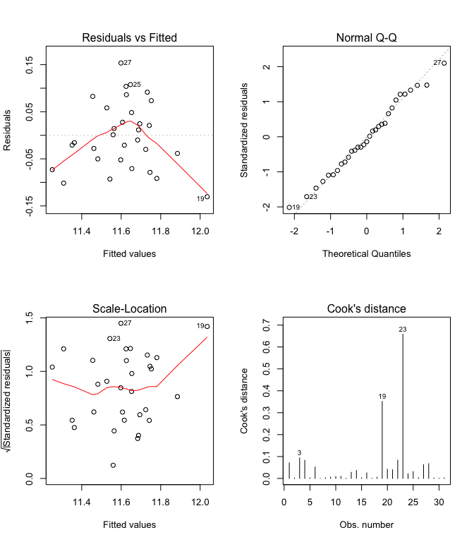

Info813 report I: Can we predict radiology visit using patient visting data?
============================================================================

Kai Li

4/4/2016

Problem statement
-----------------

Two broad groups of questions will be addressed in this report:

1.  What is the strongest determinant of the variable radiology visit
    among the three variables of patient days, emergency room visits,
    and clinic visits? And how to describe this relationship?

2.  After regress radiology visits on the three other variables, how do
    your conclusion change regarding the relationship between the
    dependent variable and each independent variable?

Data description
----------------

The original dataset includes 5 variables and 31 observations. The 4
variables are identifier, radiology visits (rad vis), patient days (p
days), emergency room visits (er vis), and clinic visits (cl vis).
Except for the identifier being a nominal variable, all the other 4
variables are ratio variables. A basic descriptive analysis was
conducted over these four variables as below:

    ##         vars  n    mean     sd median trimmed    mad  min  max range  skew
    ## rad_vis    1 31 3151.71 376.14   3252 3171.92 300.97 2317 3835  1518 -0.47
    ## p_days     2 31 6209.26 656.29   6236 6212.84 575.25 4394 7584  3190 -0.27
    ## er_vis     3 31 1383.32 176.64   1418 1390.68 130.47  997 1804   807 -0.37
    ## cl_vis     4 31 1135.55  98.85   1130 1134.00  80.06  908 1356   448  0.12
    ##         kurtosis     se
    ## rad_vis    -0.47  67.56
    ## p_days      0.34 117.87
    ## er_vis     -0.01  31.73
    ## cl_vis     -0.20  17.75

Analytical method
-----------------

To answer the research questions, correlation test and regression test
were conducted over the dataset.

The correlation test was conducted between the dependent variable,
radiology visits, and the three independent variables, separately.

The regression test was conducted to test the model between the
dependent variable, radiology visits, and the three independent
variables together. Based on its result, a new model was proposed and
tested, the results of which were compared with the first model.

Results
-------

#### Correlation

To answer the first question, the correlation between variables, the
three scatter plots between the dependent variable and three independent
variables were plotted as below:

<!-- -->

Just by looking, emergency room visits is the variable that can best
predict radiology visits, because the dots on the second scatter plot
are the closest around the virtual regression line. The closeness can be
best measured by R-squared value, or the goodness of fit. Below are the
calculated R value and corresponding p-values between radiology visits
and the three independent variables:

<table style="width:60%;">
<colgroup>
<col width="30%" />
<col width="16%" />
<col width="12%" />
</colgroup>
<thead>
<tr class="header">
<th align="center">Variable</th>
<th align="center">R-squared</th>
<th align="center">p-value</th>
</tr>
</thead>
<tbody>
<tr class="odd">
<td align="center">Patient days</td>
<td align="center">0.4681</td>
<td align="center">2.193e-05</td>
</tr>
<tr class="even">
<td align="center">Emergency room visits</td>
<td align="center">0.7537</td>
<td align="center">2.516e-10</td>
</tr>
<tr class="odd">
<td align="center">Clinic visits</td>
<td align="center">0.4358</td>
<td align="center">5.322e-05</td>
</tr>
</tbody>
</table>

The above visual observation is supported by the calculated R-squared
value, leading to the conclusion that the correlation between radiology
visits and emergency room visits is the strongest among the three
independent variables.

#### Regression

In order to create a regression model between radiology visit and three
other independent variables, the following assumptions must be met
("Regression diagnostic", n.d.), which will be addressed later in this
report.

1.  linearity of the relationship between dependent and independent
    variables
2.  independence of the errors
3.  constant variance of the errors
4.  normality of the errors
5.  multi-collinearity

The following model was established between the dependent variable,
radiology visits, and the three independent variables, patient days,
emergency room visits, and clinical visits.

    lm <- lm(rad_vis ~ p_days + er_vis + cl_vis, data = data)

However, in order to determine if this model met all the assumptions of
regression model, diagnostic plots were drawn below:

<!-- -->

According to the first plot, *residuals vs. fitted values*, the
**linearity assumption** is largely met by this model, because all the
standard residuals are within the range of +/- 2 standard errors.
Moreover, the **homoscedasticity assumption** may not be well met as
well, because the values are shown some patterns in the vertical
directions, making them not so equally distributed along the y = 0 line.
The third plot, *scale-location plot* can be used to test the same
assumption, even though the results are not clear. However, based on the
results of Breusch-Pagan test, the null hypothesis of homoscedasticity
cannot be rejected despite of the visual evidences:

    ## 
    ## Attaching package: 'car'

    ## The following object is masked from 'package:psych':
    ## 
    ##     logit

    ## Non-constant Variance Score Test 
    ## Variance formula: ~ fitted.values 
    ## Chisquare = 0.9882922    Df = 1     p = 0.3201601

Based on the second plot, *QQ Plot*, the **normality assumption** is
also not met, because of the distances between the standardized
residuals and the 45-degree line.

*Cook's distance plot* can be used to identify **influential outliers**.
In our case, value 23 not only has a relatively big value (close to 1),
but also stands out in some other plots. As a result, it is an outlier
in our dataset. However, since we cannot double check the data
collection procedures, nothing can be done to fix it.

The **independence assumption** was examined by Durbin-Watson test as
below. Because the p-value is higher than 0.05, at 95% of confidence
interval, the null hypothesis that the errors are uncorrelated cannot be
rejected.

    ## Loading required package: zoo

    ## 
    ## Attaching package: 'zoo'

    ## The following objects are masked from 'package:base':
    ## 
    ##     as.Date, as.Date.numeric

    ## 
    ##  Durbin-Watson test
    ## 
    ## data:  lm
    ## DW = 1.5984, p-value = 0.08033
    ## alternative hypothesis: true autocorrelation is greater than 0

Last but not least, **multi-collinearity** was tested using *variance
inflation factors* as below. The results for any of the three
independent variables are under 4, which is the rule of thumb, meaning
that the multi-collinearity assumption is met.

    ##   p_days   er_vis   cl_vis 
    ## 1.389103 1.762564 1.616556

Despite of the issues in normality assumption, the summary of our
original model is presented below:

    ## 
    ## Call:
    ## lm(formula = rad_vis ~ p_days + er_vis + cl_vis, data = data)
    ## 
    ## Residuals:
    ##     Min      1Q  Median      3Q     Max 
    ## -206.98  -95.70  -30.84   97.39  326.96 
    ## 
    ## Coefficients:
    ##               Estimate Std. Error t value Pr(>|t|)    
    ## (Intercept) -436.85156  351.82090  -1.242   0.2250    
    ## p_days         0.17393    0.05024   3.462   0.0018 ** 
    ## er_vis         1.32273    0.21028   6.290 9.88e-07 ***
    ## cl_vis         0.59782    0.35986   1.661   0.1082    
    ## ---
    ## Signif. codes:  0 '***' 0.001 '**' 0.01 '*' 0.05 '.' 0.1 ' ' 1
    ## 
    ## Residual standard error: 153.2 on 27 degrees of freedom
    ## Multiple R-squared:  0.8506, Adjusted R-squared:  0.834 
    ## F-statistic: 51.25 on 3 and 27 DF,  p-value: 2.816e-11

The results indicate that the overall model is valid at 95% of
confidence interval, because p-value is smaller than 0.05, and F-value
is larger than the critical F-value (3, 27). And in terms of the
predictors, like the correlation analysis shows, emergency room visits
is the strongest predictor. Patient days is another valid predictor at
99.999% of confidence interval. However, the null hypothesis that there
is no linear correlation between radiology visits and clinical visits
cannot be rejected at 95% of confidence interval, despite of the results
of correlation analysis.

To validate the results of this model, a new model was proposed using
the same variables, but radiology visits was transformed by log2. Below
are the diagnostic plots of this new model and its summary.

<!-- -->

    ## 
    ## Call:
    ## lm(formula = rad_log2 ~ p_days + er_vis + cl_vis, data = data)
    ## 
    ## Residuals:
    ##       Min        1Q    Median        3Q       Max 
    ## -0.130519 -0.051208 -0.009963  0.053287  0.153490 
    ## 
    ## Coefficients:
    ##              Estimate Std. Error t value Pr(>|t|)    
    ## (Intercept) 9.920e+00  1.725e-01  57.504  < 2e-16 ***
    ## p_days      7.935e-05  2.463e-05   3.221  0.00332 ** 
    ## er_vis      6.490e-04  1.031e-04   6.295 9.77e-07 ***
    ## cl_vis      2.654e-04  1.764e-04   1.504  0.14415    
    ## ---
    ## Signif. codes:  0 '***' 0.001 '**' 0.01 '*' 0.05 '.' 0.1 ' ' 1
    ## 
    ## Residual standard error: 0.07513 on 27 degrees of freedom
    ## Multiple R-squared:  0.8433, Adjusted R-squared:  0.8259 
    ## F-statistic: 48.43 on 3 and 27 DF,  p-value: 5.361e-11

It is clear that the range of standard residuals in this new model is
even larger than the original model; while the other requirements are
not met in a better way.

To compare with our initial model, especially because clinic visits was
not a significant predictor, a new model using radiology visits and the
two valid independent variables, patient days and emergency room visits
were created:

    lm_new <- lm(rad_vis ~ p_days + er_vis, data = data)

Below are its diagnostic plots, which show similar results as our
initial model.

<!-- -->

And below is the summary of this new model.

    ## 
    ## Call:
    ## lm(formula = rad_vis ~ p_days + er_vis, data = data)
    ## 
    ## Residuals:
    ##     Min      1Q  Median      3Q     Max 
    ## -229.10 -108.75  -27.01   82.55  343.96 
    ## 
    ## Coefficients:
    ##              Estimate Std. Error t value Pr(>|t|)    
    ## (Intercept) -91.96427  292.82726  -0.314  0.75581    
    ## p_days        0.18961    0.05088   3.727  0.00087 ***
    ## er_vis        1.49376    0.18902   7.902 1.32e-08 ***
    ## ---
    ## Signif. codes:  0 '***' 0.001 '**' 0.01 '*' 0.05 '.' 0.1 ' ' 1
    ## 
    ## Residual standard error: 158 on 28 degrees of freedom
    ## Multiple R-squared:  0.8354, Adjusted R-squared:  0.8236 
    ## F-statistic: 71.03 on 2 and 28 DF,  p-value: 1.076e-11

Based on the equation to compare the fitness of two regression models on
page 68 of the book, the resulting F-value is:

    ## [1] 2.759758

The critical F-value (1, 27) at 95% of confidence interval is 4.21,
which is larger than the F-value comparing the two models. As a result,
we cannot draw the conclusion that the new model with two independent
variables is significantly better than our initial model.

#### Validation of the regression model

In order to further validate the model, Jackknife validation method was
adopted to test if our original model was valid in general. The table
below shows the coefficiencies of the original model after each
observation is removed.

<table style="width:61%;">
<colgroup>
<col width="8%" />
<col width="16%" />
<col width="11%" />
<col width="12%" />
<col width="12%" />
</colgroup>
<thead>
<tr class="header">
<th align="center">Obs</th>
<th align="center">Intercept</th>
<th align="center">p_day</th>
<th align="center">er_vis</th>
<th align="center">cl_vis</th>
</tr>
</thead>
<tbody>
<tr class="odd">
<td align="center">1</td>
<td align="center">-365.1</td>
<td align="center">0.1725</td>
<td align="center">1.287</td>
<td align="center">0.589</td>
</tr>
<tr class="even">
<td align="center">2</td>
<td align="center">-427.3</td>
<td align="center">0.1734</td>
<td align="center">1.307</td>
<td align="center">0.612</td>
</tr>
<tr class="odd">
<td align="center">3</td>
<td align="center">-321.7</td>
<td align="center">0.1724</td>
<td align="center">1.272</td>
<td align="center">0.5714</td>
</tr>
<tr class="even">
<td align="center">4</td>
<td align="center">-419.9</td>
<td align="center">0.1676</td>
<td align="center">1.412</td>
<td align="center">0.5041</td>
</tr>
<tr class="odd">
<td align="center">5</td>
<td align="center">-420.4</td>
<td align="center">0.1736</td>
<td align="center">1.304</td>
<td align="center">0.6101</td>
</tr>
<tr class="even">
<td align="center">6</td>
<td align="center">-319.5</td>
<td align="center">0.1784</td>
<td align="center">1.355</td>
<td align="center">0.435</td>
</tr>
<tr class="odd">
<td align="center">7</td>
<td align="center">-435.3</td>
<td align="center">0.1759</td>
<td align="center">1.317</td>
<td align="center">0.5936</td>
</tr>
<tr class="even">
<td align="center">8</td>
<td align="center">-418.9</td>
<td align="center">0.1738</td>
<td align="center">1.31</td>
<td align="center">0.5987</td>
</tr>
<tr class="odd">
<td align="center">9</td>
<td align="center">-429.9</td>
<td align="center">0.1697</td>
<td align="center">1.326</td>
<td align="center">0.6084</td>
</tr>
<tr class="even">
<td align="center">10</td>
<td align="center">-463.1</td>
<td align="center">0.1751</td>
<td align="center">1.293</td>
<td align="center">0.655</td>
</tr>
<tr class="odd">
<td align="center">11</td>
<td align="center">-458.5</td>
<td align="center">0.1783</td>
<td align="center">1.316</td>
<td align="center">0.6067</td>
</tr>
<tr class="even">
<td align="center">12</td>
<td align="center">-436.8</td>
<td align="center">0.1739</td>
<td align="center">1.323</td>
<td align="center">0.5977</td>
</tr>
<tr class="odd">
<td align="center">13</td>
<td align="center">-532.3</td>
<td align="center">0.1768</td>
<td align="center">1.31</td>
<td align="center">0.6879</td>
</tr>
<tr class="even">
<td align="center">14</td>
<td align="center">-535.9</td>
<td align="center">0.1739</td>
<td align="center">1.336</td>
<td align="center">0.6753</td>
</tr>
<tr class="odd">
<td align="center">15</td>
<td align="center">-454.9</td>
<td align="center">0.1787</td>
<td align="center">1.324</td>
<td align="center">0.5877</td>
</tr>
<tr class="even">
<td align="center">16</td>
<td align="center">-503.1</td>
<td align="center">0.1778</td>
<td align="center">1.313</td>
<td align="center">0.6491</td>
</tr>
<tr class="odd">
<td align="center">17</td>
<td align="center">-437.3</td>
<td align="center">0.1729</td>
<td align="center">1.321</td>
<td align="center">0.6053</td>
</tr>
<tr class="even">
<td align="center">18</td>
<td align="center">-452.4</td>
<td align="center">0.1727</td>
<td align="center">1.301</td>
<td align="center">0.6423</td>
</tr>
<tr class="odd">
<td align="center">19</td>
<td align="center">-664.3</td>
<td align="center">0.1908</td>
<td align="center">1.415</td>
<td align="center">0.6009</td>
</tr>
<tr class="even">
<td align="center">20</td>
<td align="center">-484.5</td>
<td align="center">0.1658</td>
<td align="center">1.294</td>
<td align="center">0.7137</td>
</tr>
<tr class="odd">
<td align="center">21</td>
<td align="center">-385.8</td>
<td align="center">0.1551</td>
<td align="center">1.317</td>
<td align="center">0.6566</td>
</tr>
<tr class="even">
<td align="center">22</td>
<td align="center">-279.8</td>
<td align="center">0.1729</td>
<td align="center">1.373</td>
<td align="center">0.396</td>
</tr>
<tr class="odd">
<td align="center">23</td>
<td align="center">-253.9</td>
<td align="center">0.09456</td>
<td align="center">1.484</td>
<td align="center">0.685</td>
</tr>
<tr class="even">
<td align="center">24</td>
<td align="center">-490.7</td>
<td align="center">0.184</td>
<td align="center">1.298</td>
<td align="center">0.617</td>
</tr>
<tr class="odd">
<td align="center">25</td>
<td align="center">-466.5</td>
<td align="center">0.1818</td>
<td align="center">1.275</td>
<td align="center">0.6314</td>
</tr>
<tr class="even">
<td align="center">26</td>
<td align="center">-452.4</td>
<td align="center">0.1759</td>
<td align="center">1.31</td>
<td align="center">0.6146</td>
</tr>
<tr class="odd">
<td align="center">27</td>
<td align="center">-460.6</td>
<td align="center">0.1898</td>
<td align="center">1.305</td>
<td align="center">0.5436</td>
</tr>
<tr class="even">
<td align="center">28</td>
<td align="center">-403.3</td>
<td align="center">0.1899</td>
<td align="center">1.327</td>
<td align="center">0.4687</td>
</tr>
<tr class="odd">
<td align="center">29</td>
<td align="center">-412.5</td>
<td align="center">0.173</td>
<td align="center">1.341</td>
<td align="center">0.5608</td>
</tr>
<tr class="even">
<td align="center">30</td>
<td align="center">-438.2</td>
<td align="center">0.1717</td>
<td align="center">1.33</td>
<td align="center">0.6039</td>
</tr>
<tr class="odd">
<td align="center">31</td>
<td align="center">-434.9</td>
<td align="center">0.1776</td>
<td align="center">1.301</td>
<td align="center">0.6008</td>
</tr>
</tbody>
</table>

Conclusions
-----------

As is shown by our analysis, emergency room visits is the variable that
most strongly correlates with radiology visits, in both tests. And
despite of its strong correlation, clinic visits was found not to be
able to predict radiology visits in our initial model, which might be
because of multi-collinearity.

Another conclusion is that, despite of removing an independent variable
that is proven not to be able to predict the dependent variable, our new
model isn't significantly better than the original one.
