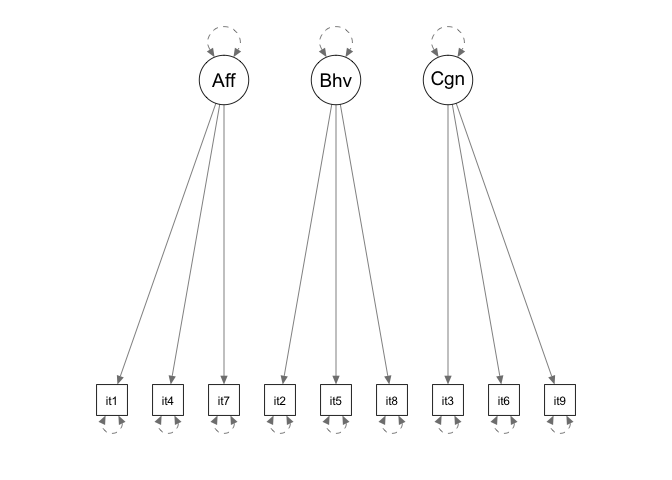

Info813 report week 2: Confirmatory factor analysis on attitude
===============================================================

Problem statement
-----------------

The following questions will be answered in the report:

1.  Is the three-factor model of attitude adequate to explain the
    pattern of correlation observed in the data?
2.  Is the first model combined with the method factors a better model
    than the original model?
3.  How should the discriminant validity of the three method factors in
    section 2 be evaluated?

Data description
----------------

The dataset, entitled "Ostrom.sav", is a correlation table between 9
variables based on Ostrom's attitude dataset collected in 1969. The 9
variables were the 3 components of attitudes (affective, behavioral, and
cognitive) measured using three different scales (Thurstone, Likert, and
Guttman). Below is the detailed definition of these 9 variables:

<table>
<thead>
<tr class="header">
<th align="left">Variable name</th>
<th align="left">Methods</th>
</tr>
</thead>
<tbody>
<tr class="odd">
<td align="left">item1</td>
<td align="left">Affective -- Thurstone</td>
</tr>
<tr class="even">
<td align="left">item2</td>
<td align="left">Behaviroal -- Thurstone</td>
</tr>
<tr class="odd">
<td align="left">item3</td>
<td align="left">Cognitive -- Thrustone</td>
</tr>
<tr class="even">
<td align="left">item4</td>
<td align="left">Affective -- Likert</td>
</tr>
<tr class="odd">
<td align="left">item5</td>
<td align="left">Behaviroal -- Likert</td>
</tr>
<tr class="even">
<td align="left">item6</td>
<td align="left">Cognitive -- Likert</td>
</tr>
<tr class="odd">
<td align="left">item7</td>
<td align="left">Affective -- Guttman</td>
</tr>
<tr class="even">
<td align="left">item8</td>
<td align="left">Behaviroal -- Guttman</td>
</tr>
<tr class="odd">
<td align="left">item9</td>
<td align="left">Cognitive -- Guttman</td>
</tr>
</tbody>
</table>

And below is the dataset per se:

<table style="width:100%;">
<colgroup>
<col width="14%" />
<col width="9%" />
<col width="9%" />
<col width="9%" />
<col width="9%" />
<col width="9%" />
<col width="9%" />
<col width="9%" />
<col width="9%" />
<col width="9%" />
</colgroup>
<thead>
<tr class="header">
<th align="center"> </th>
<th align="center">item1</th>
<th align="center">item2</th>
<th align="center">item3</th>
<th align="center">item4</th>
<th align="center">item5</th>
<th align="center">item6</th>
<th align="center">item7</th>
<th align="center">item8</th>
<th align="center">item9</th>
</tr>
</thead>
<tbody>
<tr class="odd">
<td align="center"><strong>item1</strong></td>
<td align="center">1</td>
<td align="center">0</td>
<td align="center">0</td>
<td align="center">0</td>
<td align="center">0</td>
<td align="center">0</td>
<td align="center">0</td>
<td align="center">0</td>
<td align="center">0</td>
</tr>
<tr class="even">
<td align="center"><strong>item2</strong></td>
<td align="center">0.57</td>
<td align="center">1</td>
<td align="center">0</td>
<td align="center">0</td>
<td align="center">0</td>
<td align="center">0</td>
<td align="center">0</td>
<td align="center">0</td>
<td align="center">0</td>
</tr>
<tr class="odd">
<td align="center"><strong>item3</strong></td>
<td align="center">0.63</td>
<td align="center">0.62</td>
<td align="center">1</td>
<td align="center">0</td>
<td align="center">0</td>
<td align="center">0</td>
<td align="center">0</td>
<td align="center">0</td>
<td align="center">0</td>
</tr>
<tr class="even">
<td align="center"><strong>item4</strong></td>
<td align="center">0.71</td>
<td align="center">0.59</td>
<td align="center">0.68</td>
<td align="center">1</td>
<td align="center">0</td>
<td align="center">0</td>
<td align="center">0</td>
<td align="center">0</td>
<td align="center">0</td>
</tr>
<tr class="odd">
<td align="center"><strong>item5</strong></td>
<td align="center">0.67</td>
<td align="center">0.67</td>
<td align="center">0.71</td>
<td align="center">0.79</td>
<td align="center">1</td>
<td align="center">0</td>
<td align="center">0</td>
<td align="center">0</td>
<td align="center">0</td>
</tr>
<tr class="even">
<td align="center"><strong>item6</strong></td>
<td align="center">0.69</td>
<td align="center">0.62</td>
<td align="center">0.72</td>
<td align="center">0.79</td>
<td align="center">0.81</td>
<td align="center">1</td>
<td align="center">0</td>
<td align="center">0</td>
<td align="center">0</td>
</tr>
<tr class="odd">
<td align="center"><strong>item7</strong></td>
<td align="center">0.54</td>
<td align="center">0.39</td>
<td align="center">0.49</td>
<td align="center">0.58</td>
<td align="center">0.51</td>
<td align="center">0.56</td>
<td align="center">1</td>
<td align="center">0</td>
<td align="center">0</td>
</tr>
<tr class="even">
<td align="center"><strong>item8</strong></td>
<td align="center">0.59</td>
<td align="center">0.61</td>
<td align="center">0.58</td>
<td align="center">0.6</td>
<td align="center">0.69</td>
<td align="center">0.6</td>
<td align="center">0.43</td>
<td align="center">1</td>
<td align="center">0</td>
</tr>
<tr class="odd">
<td align="center"><strong>item9</strong></td>
<td align="center">0.63</td>
<td align="center">0.5</td>
<td align="center">0.63</td>
<td align="center">0.69</td>
<td align="center">0.67</td>
<td align="center">0.71</td>
<td align="center">0.49</td>
<td align="center">0.56</td>
<td align="center">1</td>
</tr>
</tbody>
</table>

Research method
---------------

Confirmatory factor analysis (CFA) method was conducted using Lavaan
package (version 0.5-20), semPlot package (version 1.0.1), and semTools
package (version 0.4-11) under RStudio system (version 0.99.983).

Two models were established using the operationalized concept factors as
well as the method factors. The results of these two models were
discussed and compared. And the average variance and shared variance of
the three factors in the second model were calculated.

Result
------

#### Question 1

In order to answer the first question, the following model was
established containing the three latent variables, and covariances
between them.

    cfa.model1 <- "
    Affective =~ item1 + item4 + item7
    Behavioral =~ item2 + item5 + item8
    Cognitive =~ item3 + item6 + item9
    "

In Ostrom's original paper about the dataset (1969), it is stated that
the correlation table was generated using experts' rating of 163
statements about attitude, which is presumably the original sample size.
This number was used in the Lavaan function. Below is the path plot of
this model. It is worth noting that even though the covariance lines
were not drawn between the three latent variables, they were actually
calculated in the final results.

    ## Found more than one class "Model" in cache; using the first, from namespace 'lavaan'

<!-- -->

And below is the summary of this model.

    ## lavaan (0.5-20) converged normally after  42 iterations
    ## 
    ##   Number of observations                           163
    ## 
    ##   Estimator                                         ML
    ##   Minimum Function Test Statistic               23.481
    ##   Degrees of freedom                                24
    ##   P-value (Chi-square)                           0.492
    ## 
    ## Model test baseline model:
    ## 
    ##   Minimum Function Test Statistic             1102.443
    ##   Degrees of freedom                                36
    ##   P-value                                        0.000
    ## 
    ## User model versus baseline model:
    ## 
    ##   Comparative Fit Index (CFI)                    1.000
    ##   Tucker-Lewis Index (TLI)                       1.001
    ## 
    ## Loglikelihood and Information Criteria:
    ## 
    ##   Loglikelihood user model (H0)              -1537.588
    ##   Loglikelihood unrestricted model (H1)      -1525.848
    ## 
    ##   Number of free parameters                         21
    ##   Akaike (AIC)                                3117.176
    ##   Bayesian (BIC)                              3182.145
    ##   Sample-size adjusted Bayesian (BIC)         3115.662
    ## 
    ## Root Mean Square Error of Approximation:
    ## 
    ##   RMSEA                                          0.000
    ##   90 Percent Confidence Interval          0.000  0.062
    ##   P-value RMSEA <= 0.05                          0.873
    ## 
    ## Standardized Root Mean Square Residual:
    ## 
    ##   SRMR                                           0.022
    ## 
    ## Parameter Estimates:
    ## 
    ##   Information                                 Expected
    ##   Standard Errors                             Standard
    ## 
    ## Latent Variables:
    ##                    Estimate  Std.Err  Z-value  P(>|z|)
    ##   Affective =~                                        
    ##     item1             1.000                           
    ##     item4             1.124    0.084   13.420    0.000
    ##     item7             0.798    0.093    8.613    0.000
    ##   Behavioral =~                                       
    ##     item2             1.000                           
    ##     item5             1.263    0.106   11.904    0.000
    ##     item8             1.017    0.107    9.543    0.000
    ##   Cognitive =~                                        
    ##     item3             1.000                           
    ##     item6             1.126    0.081   13.818    0.000
    ##     item9             0.975    0.086   11.278    0.000
    ## 
    ## Covariances:
    ##                    Estimate  Std.Err  Z-value  P(>|z|)
    ##   Affective ~~                                        
    ##     Behavioral        0.539    0.082    6.551    0.000
    ##     Cognitive         0.618    0.088    7.018    0.000
    ##   Behavioral ~~                                       
    ##     Cognitive         0.556    0.084    6.649    0.000
    ## 
    ## Variances:
    ##                    Estimate  Std.Err  Z-value  P(>|z|)
    ##     item1             0.358    0.046    7.729    0.000
    ##     item4             0.190    0.035    5.460    0.000
    ##     item7             0.589    0.069    8.548    0.000
    ##     item2             0.457    0.056    8.228    0.000
    ##     item5             0.138    0.032    4.302    0.000
    ##     item8             0.439    0.054    8.164    0.000
    ##     item3             0.354    0.045    7.954    0.000
    ##     item6             0.183    0.030    6.013    0.000
    ##     item9             0.386    0.048    8.103    0.000
    ##     Affective         0.636    0.105    6.032    0.000
    ##     Behavioral        0.536    0.100    5.345    0.000
    ##     Cognitive         0.640    0.105    6.093    0.000

Because that:

-   Chi-square result is insignificant;
-   CFI and TLI are higher than 0.90; and
-   RMSEA is smaller than 0.05,

we can draw the conclusion that this model is a good fit. However, to
determine is the classification of all the variables is equally good, a
modification index test was conducted using "modindices" function under
Lavaan package. And below is the result:

    ##           lhs op   rhs    mi    epc sepc.lv sepc.all sepc.nox
    ## 53      item4 ~~ item5 4.180  0.049   0.049    0.049    0.049
    ## 66      item2 ~~ item3 4.083  0.071   0.071    0.072    0.072
    ## 41  Cognitive =~ item5 3.817  1.579   1.263    1.267    1.267
    ## 65      item2 ~~ item8 3.783  0.077   0.077    0.077    0.077
    ## 74      item8 ~~ item6 3.724 -0.055  -0.055   -0.055   -0.055
    ## 71      item5 ~~ item6 3.005  0.041   0.041    0.041    0.041
    ## 33 Behavioral =~ item7 2.440 -0.600  -0.439   -0.441   -0.441
    ## 47      item1 ~~ item8 2.406  0.055   0.055    0.055    0.055
    ## 46      item1 ~~ item5 2.385 -0.041  -0.041   -0.041   -0.041
    ## 36 Behavioral =~ item9 1.760 -0.579  -0.424   -0.425   -0.425
    ## 26  Affective =~ item5 1.491  0.589   0.469    0.471    0.471
    ## 68      item2 ~~ item9 1.459 -0.044  -0.044   -0.044   -0.044
    ## 59      item7 ~~ item5 1.428 -0.037  -0.037   -0.037   -0.037
    ## 42  Cognitive =~ item8 1.363 -0.584  -0.467   -0.468   -0.468
    ## 64      item2 ~~ item5 1.308 -0.043  -0.043   -0.043   -0.043
    ## 55      item4 ~~ item3 1.281 -0.032  -0.032   -0.032   -0.032
    ## 45      item1 ~~ item2 1.207  0.039   0.039    0.040    0.040
    ## 32 Behavioral =~ item4 1.179  0.455   0.333    0.334    0.334
    ## 34 Behavioral =~ item3 1.117  0.455   0.334    0.335    0.335
    ## 43      item1 ~~ item4 1.048 -0.046  -0.046   -0.046   -0.046
    ## 52      item4 ~~ item2 1.006 -0.030  -0.030   -0.030   -0.030
    ## 54      item4 ~~ item8 0.987 -0.029  -0.029   -0.029   -0.029
    ## 39  Cognitive =~ item7 0.920 -0.765  -0.612   -0.614   -0.614
    ## 72      item5 ~~ item9 0.878 -0.025  -0.025   -0.025   -0.025
    ## 30  Affective =~ item9 0.870  0.613   0.489    0.491    0.491
    ## 44      item1 ~~ item7 0.845  0.037   0.037    0.038    0.038
    ## 38  Cognitive =~ item4 0.687  1.188   0.950    0.953    0.953
    ## 50      item1 ~~ item9 0.630  0.027   0.027    0.027    0.027
    ## 28  Affective =~ item3 0.594 -0.502  -0.400   -0.401   -0.401
    ## 49      item1 ~~ item6 0.507 -0.020  -0.020   -0.020   -0.020
    ## 75      item8 ~~ item9 0.433  0.024   0.024    0.024    0.024
    ## 27  Affective =~ item8 0.418 -0.234  -0.187   -0.187   -0.187
    ## 58      item7 ~~ item2 0.417 -0.028  -0.028   -0.028   -0.028
    ## 25  Affective =~ item2 0.248 -0.179  -0.143   -0.143   -0.143
    ## 70      item5 ~~ item3 0.224 -0.012  -0.012   -0.013   -0.013
    ## 67      item2 ~~ item6 0.203 -0.013  -0.013   -0.013   -0.013
    ## 73      item8 ~~ item3 0.189  0.015   0.015    0.015    0.015
    ## 48      item1 ~~ item3 0.181  0.014   0.014    0.014    0.014
    ## 76      item3 ~~ item6 0.140 -0.012  -0.012   -0.012   -0.012
    ## 69      item5 ~~ item8 0.122 -0.013  -0.013   -0.013   -0.013
    ## 40  Cognitive =~ item2 0.111 -0.164  -0.131   -0.132   -0.132
    ## 37  Cognitive =~ item1 0.101  0.327   0.261    0.262    0.262
    ## 62      item7 ~~ item6 0.101  0.010   0.010    0.010    0.010
    ## 51      item4 ~~ item7 0.099  0.012   0.012    0.012    0.012
    ## 56      item4 ~~ item6 0.084  0.007   0.007    0.007    0.007
    ## 78      item6 ~~ item9 0.081  0.009   0.009    0.009    0.009
    ## 57      item4 ~~ item9 0.074  0.008   0.008    0.008    0.008
    ## 60      item7 ~~ item8 0.059  0.010   0.010    0.011    0.011
    ## 63      item7 ~~ item9 0.056  0.010   0.010    0.010    0.010
    ## 35 Behavioral =~ item6 0.039  0.086   0.063    0.063    0.063
    ## 31 Behavioral =~ item1 0.016  0.049   0.036    0.036    0.036
    ## 29  Affective =~ item6 0.014 -0.078  -0.062   -0.062   -0.062
    ## 77      item3 ~~ item9 0.012  0.004   0.004    0.004    0.004
    ## 61      item7 ~~ item3 0.000  0.000   0.000    0.000    0.000

It is shown by the results that Cognitive factor and item 5, Behavioral
factor and item 7 and item 9 have much stronger connections than in the
current model, which suggests some potential future revisions to this
model.

#### Question 2

In order to add the method factor into our consideration, a new model
was proposed as below:

    cfa.model2 <- "
    Affective =~ item1 + item4 + item7
    Behavioral =~ item2 + item5 + item8
    Cognitive =~ item3 + item6 + item9
    Thurstone =~ item1 + item2 + item3
    Likert =~ item4 + item5 + item6
    Guttman =~ item7 + item8 + item9
    "

Unlike the first model, the covariance between the method factors were
not included in this overall model, because it was assumed that each
method used in the original experiment were independent. And below is
the summary of this model:

    ## lavaan (0.5-20) converged normally after 3068 iterations
    ## 
    ##   Number of observations                           163
    ## 
    ##   Estimator                                         ML
    ##   Minimum Function Test Statistic                0.528
    ##   Degrees of freedom                                 3
    ##   P-value (Chi-square)                           0.913
    ## 
    ## Model test baseline model:
    ## 
    ##   Minimum Function Test Statistic             1102.443
    ##   Degrees of freedom                                36
    ##   P-value                                        0.000
    ## 
    ## User model versus baseline model:
    ## 
    ##   Comparative Fit Index (CFI)                    1.000
    ##   Tucker-Lewis Index (TLI)                       1.028
    ## 
    ## Loglikelihood and Information Criteria:
    ## 
    ##   Loglikelihood user model (H0)              -1526.111
    ##   Loglikelihood unrestricted model (H1)      -1525.848
    ## 
    ##   Number of free parameters                         42
    ##   Akaike (AIC)                                3136.223
    ##   Bayesian (BIC)                              3266.160
    ##   Sample-size adjusted Bayesian (BIC)         3133.194
    ## 
    ## Root Mean Square Error of Approximation:
    ## 
    ##   RMSEA                                          0.000
    ##   90 Percent Confidence Interval          0.000  0.050
    ##   P-value RMSEA <= 0.05                          0.950
    ## 
    ## Standardized Root Mean Square Residual:
    ## 
    ##   SRMR                                           0.003
    ## 
    ## Parameter Estimates:
    ## 
    ##   Information                                 Expected
    ##   Standard Errors                             Standard
    ## 
    ## Latent Variables:
    ##                    Estimate  Std.Err  Z-value  P(>|z|)
    ##   Affective =~                                        
    ##     item1             0.637    0.461    1.381    0.167
    ##     item4             0.553    0.726    0.761    0.447
    ##     item7             0.656    0.278    2.358    0.018
    ##   Behavioral =~                                       
    ##     item2            -2.501   48.125   -0.052    0.959
    ##     item5             0.476    1.498    0.318    0.751
    ##     item8            23.041 1199.700    0.019    0.985
    ##   Cognitive =~                                        
    ##     item3             0.593    0.552    1.074    0.283
    ##     item6             0.710    0.674    1.052    0.293
    ##     item9             1.132    1.553    0.729    0.466
    ##   Thurstone =~                                        
    ##     item1             0.213    0.402    0.529    0.597
    ##     item2             3.346   48.011    0.070    0.944
    ##     item3             0.233    0.461    0.505    0.614
    ##   Likert =~                                           
    ##     item4             0.421    0.428    0.985    0.325
    ##     item5             0.514    1.454    0.354    0.724
    ##     item6             0.223    0.597    0.374    0.708
    ##   Guttman =~                                          
    ##     item7             0.014    0.311    0.046    0.963
    ##     item8           -22.361 1199.871   -0.019    0.985
    ##     item9            -0.363    1.511   -0.241    0.810
    ## 
    ## Covariances:
    ##                    Estimate  Std.Err  Z-value  P(>|z|)
    ##   Affective ~~                                        
    ##     Behavioral        0.809    0.666    1.214    0.225
    ##     Cognitive         0.919    0.075   12.167    0.000
    ##     Thurstone         0.776    0.833    0.932    0.351
    ##     Likert            0.731    1.031    0.708    0.479
    ##     Guttman           0.805    0.642    1.254    0.210
    ##   Behavioral ~~                                       
    ##     Cognitive         0.939    0.413    2.275    0.023
    ##     Thurstone         0.960    0.624    1.537    0.124
    ##     Likert            0.739    0.424    1.743    0.081
    ##     Guttman           0.993    0.346    2.867    0.004
    ##   Cognitive ~~                                        
    ##     Thurstone         0.901    0.753    1.196    0.232
    ##     Likert            0.807    0.796    1.014    0.311
    ##     Guttman           0.938    0.422    2.220    0.026
    ##   Thurstone ~~                                        
    ##     Likert            0.743    0.369    2.017    0.044
    ##     Guttman           0.953    0.735    1.297    0.195
    ##   Likert ~~                                           
    ##     Guttman           0.737    0.457    1.612    0.107
    ## 
    ## Variances:
    ##                    Estimate  Std.Err  Z-value  P(>|z|)
    ##     item1             0.332    0.061    5.432    0.000
    ##     item4             0.171    0.131    1.307    0.191
    ##     item7             0.548    0.077    7.094    0.000
    ##     item2            -0.390   12.041   -0.032    0.974
    ##     item5             0.141    0.075    1.880    0.060
    ##     item8            -6.314  367.882   -0.017    0.986
    ##     item3             0.339    0.079    4.284    0.000
    ##     item6             0.185    0.044    4.246    0.000
    ##     item9             0.352    0.067    5.272    0.000
    ##     Affective         1.000                           
    ##     Behavioral        1.000                           
    ##     Cognitive         1.000                           
    ##     Thurstone         1.000                           
    ##     Likert            1.000                           
    ##     Guttman           1.000

In order to compare these two models, an ANOVA test was conducted as
below. It is worth noting that despite of the much higher Chi-square
value of the initial model, the very high p-value suggests that there
might be no significant difference between the two models.

    ## Chi Square Difference Test
    ## 
    ##          Df    AIC    BIC   Chisq Chisq diff Df diff Pr(>Chisq)
    ## cfa.fit2  3 3136.2 3266.2  0.5276                              
    ## cfa.fit  24 3117.2 3182.1 23.4812     22.954      21     0.3465

#### Question 3

According to Farrell & Rudd's paper (2009), in order for any two
constructs to be discriminant valid, the average of AVE (average amount
of variance) of both factors need to be larger than the shared variance
(square of the correlation) between A and B. As a result, the following
table was drawn to compare these values:

<table style="width:38%;">
<colgroup>
<col width="27%" />
<col width="9%" />
</colgroup>
<thead>
<tr class="header">
<th align="center">Variable</th>
<th align="center">Value</th>
</tr>
</thead>
<tbody>
<tr class="odd">
<td align="center">AVEVAR of Thurstone</td>
<td align="center">0.9057</td>
</tr>
<tr class="even">
<td align="center">AVEVAR of Likert</td>
<td align="center">0.8333</td>
</tr>
<tr class="odd">
<td align="center">AVEVAR of Guttman</td>
<td align="center">2.816</td>
</tr>
<tr class="even">
<td align="center">Thurstone_Likert</td>
<td align="center">0.7433</td>
</tr>
<tr class="odd">
<td align="center">Thurstone_Guttman</td>
<td align="center">0.9534</td>
</tr>
<tr class="even">
<td align="center">Likert_Guttman</td>
<td align="center">0.7365</td>
</tr>
</tbody>
</table>

The table suggests that there is discriminant validity between all of
the three method factors in our model.

Conclusion
----------

Our study suggests that with Ostrom's dataset, even though both
attitude-only model and attitude-method model could explain the data
well, the first model might be the better one, despite of the fact that
this difference might be just coincidental.

Moreover, there is discriminant validity between all of the three method
factors.

Reference
---------

Farrell, A. M., & Rudd, J. M. (2009). Factor analysis and discriminant
validity: A brief review of some practical issues. Anzmac. Retrieved
from <http://eprints.aston.ac.uk/7644/>

Ostrom, T. M. (1969). The relationship between the affective,
behavioral, and cognitive components of attitude. Journal of
Experimental Social Psychology, 5(1), 12–30.
<http://doi.org/10.1016/0022-1031(69)90003-1>
