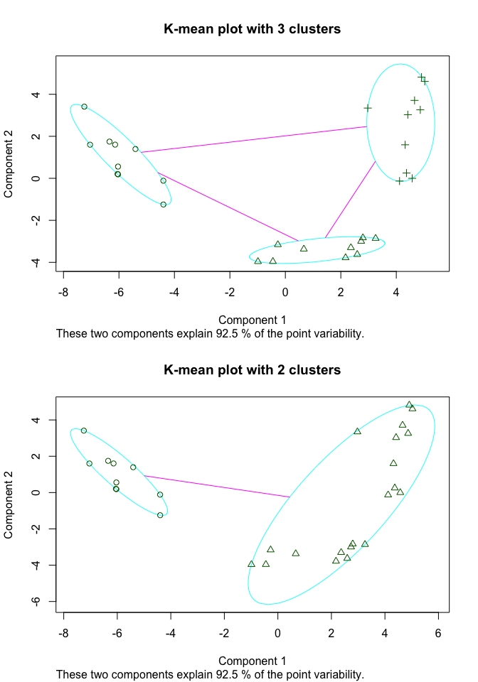

Info813 report week 3: Cluster analysis on dissmilarities among organizations
=============================================================================

Question statement
------------------

1.  What cluster method would you use to analyze the data?
2.  Interpret the result.

Data description
----------------

The data was claimed to be collected by John Johns about the
dissimilarities of 30 different organizations. Informants were asked to
rate the dissimilarities of a pair of organization. The dataset is a
symmetric 30 x 30 dissimilarity matrix, a part of which is presented
below.

    output[1:5, 1:5]

    ##       o1  o2  o3  o4  o5
    ## [1,]   0 227 244 363 286
    ## [2,] 227   0 126 289 264
    ## [3,] 244 126   0 176 154
    ## [4,] 363 289 176   0  86
    ## [5,] 286 264 154  86   0

Research method
---------------

Agglomerative and partitioning clustering methods were used in this
report. The clustering methods were also evaluated.

In order to determine the modality of the dataset, a scatter plot matrix
was plotted below. Because of the large number of variables in the
dataset, only a part of the scatter plots was presented. In sum, there
doesn't seem to be strong unimodality in this dataset.

<!-- -->

A heatmap based on the dataset was plotted below. Disregarding the
dendrogram, there seems to be three clusters in this dataset.

<!-- -->

All the distances were calculated using Euclidean method.

Results
-------

#### Agglomerative clustering

The dendrogram of the dataset using Euclidean method was plotted below.
Combining with the heatmap shown above, the three-cluster solution seems
to best describe the dataset.

<!-- -->

However, two-cluster solution could also work on a different level.

<!-- -->

#### Partitioning

Following what we have known, a K-mean method was used with K = 3. And
as comparison, the K-mean plot with K = 2 was plotted below. Below is
the result. It is not surprising that all the observations were
classified into the same group with agglomerative and partitioning
methods.

<!-- -->

#### Evaluation of the results

In order to determine if the 3-cluster solution is significantly better
than the 2-cluster solution (and 4-cluster and 5-cluster solutions),
pseudo-F statistic was calculated below. Because the 3-cluster
solution's pseudo-F value is much higher than 2-cluster solution, it
could support the conclusion that 3-cluster solution is a better one, at
least in terms of the within-group heterogeneity.

<table style="width:38%;">
<colgroup>
<col width="15%" />
<col width="22%" />
</colgroup>
<thead>
<tr class="header">
<th align="center">Solution</th>
<th align="center">pseudo-F value</th>
</tr>
</thead>
<tbody>
<tr class="odd">
<td align="center">2-cluster</td>
<td align="center">67.99</td>
</tr>
<tr class="even">
<td align="center">3-cluster</td>
<td align="center">114.3</td>
</tr>
<tr class="odd">
<td align="center">4-cluster</td>
<td align="center">92.64</td>
</tr>
<tr class="even">
<td align="center">5-cluster</td>
<td align="center">77.64</td>
</tr>
</tbody>
</table>

Another validation method about betweenness is to compare the between
sum of squares / total sum of squares, which the percentage of total
variance that is explained by the cluster. Below is the summary of this
number from 2 to 5-cluster solutions.

<table style="width:57%;">
<colgroup>
<col width="15%" />
<col width="41%" />
</colgroup>
<thead>
<tr class="header">
<th align="center">Solution</th>
<th align="center">Percentage of total variance</th>
</tr>
</thead>
<tbody>
<tr class="odd">
<td align="center">2-cluster</td>
<td align="center">0.6454</td>
</tr>
<tr class="even">
<td align="center">3-cluster</td>
<td align="center">0.8594</td>
</tr>
<tr class="odd">
<td align="center">4-cluster</td>
<td align="center">0.8894</td>
</tr>
<tr class="even">
<td align="center">5-cluster</td>
<td align="center">0.9036</td>
</tr>
</tbody>
</table>

In terms of the withinness of the clusters, Silhouette plot were used to
evaluate the results 2 to 5-cluster solutions. Below is the Silhouette
plot for 3-cluster solution.

<!-- --><!-- -->

In Silhouette plot, the higher the average silhouette width is, the
better all the objects lie within each cluster. According to the
results, 3-cluster solution, again, is the better one, even though the
difference is marginal.

<table style="width:50%;">
<colgroup>
<col width="15%" />
<col width="34%" />
</colgroup>
<thead>
<tr class="header">
<th align="center">Solution</th>
<th align="center">Average sihouette width</th>
</tr>
</thead>
<tbody>
<tr class="odd">
<td align="center">2-cluster</td>
<td align="center">0.5452</td>
</tr>
<tr class="even">
<td align="center">3-cluster</td>
<td align="center">0.5899</td>
</tr>
<tr class="odd">
<td align="center">4-cluster</td>
<td align="center">0.5235</td>
</tr>
<tr class="even">
<td align="center">5-cluster</td>
<td align="center">0.5033</td>
</tr>
</tbody>
</table>

Conclusion
----------

It is shown by this report that in terms of this dataset, agglomerative
and partitioning methods do not make much difference. Pretty much
identical results were generated using these two methods.

What matters is the number of clusters. By ignoring an obvious cluster,
the 2-cluster solution has about the same level of withinness from other
solutions, but a much lower level of betweenness. However, the best
solution, the 3-cluster solution, doesn't have significant difference
from 4- and 5-cluster solutions in both withinness and betweenness.
