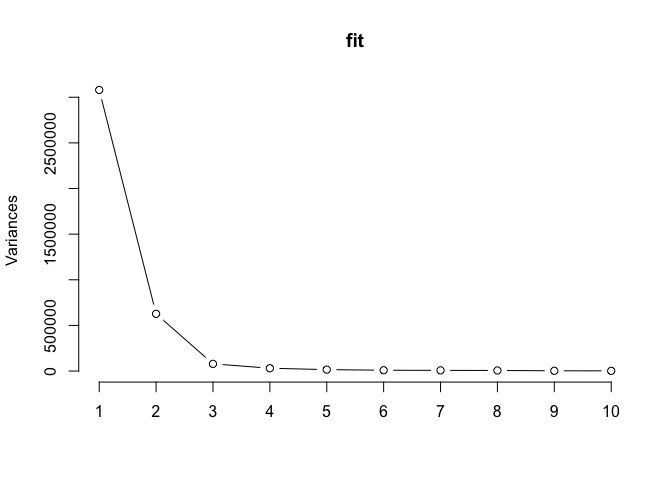
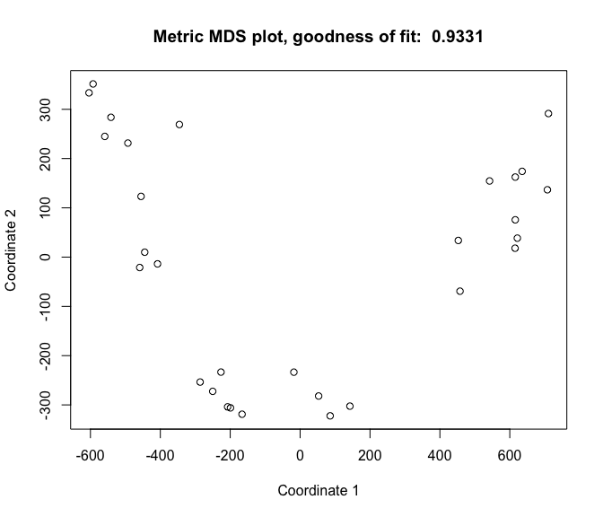
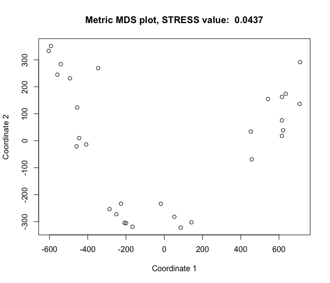
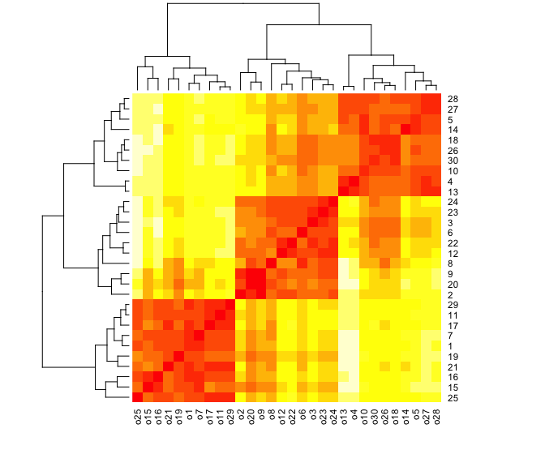

Info813 report week 4: MDS analysis on dissmilarities among organizations
=========================================================================

Problem statement
-----------------

1.  What scaling method would you use to analyze the data?
2.  How to interprete the data and the results?

Data description
----------------

The data was claimed to be collected by John Johns about the
dissimilarities among 30 different organizations. Informants were asked
to rate the dissimilarities of a pair of organization. For the sake of
the study, it is assumed that all the informants are homogeneous. The
dataset is a symmetric 30 x 30 dissimilarity matrix, a part of which is
presented below. And after this step, all the distances were calculated
using Euclidean method.

    output[1:5, 1:5]

    ##       o1  o2  o3  o4  o5
    ## [1,]   0 227 244 363 286
    ## [2,] 227   0 126 289 264
    ## [3,] 244 126   0 176 154
    ## [4,] 363 289 176   0  86
    ## [5,] 286 264 154  86   0

Research method
---------------

The choice of MDS method is highly reliant on the nature of the data, so
the first decision to make is whether the data can be seen as
interval/ratio, or just ordinal. Because both understandings seem to be
reasonable, both **classical MDS method** and **nonmetric MDS method**
are used in this report to compare the results.

Results
-------

#### Deciding the number of dimensions

The scree plot using Principal Components Analysis method is plotted
below. Package *Stats version 3.2.4* is used for this analysis. It seems
that 2-dimention is able to explain 95.8% of the variance in the
dataset, so it's decided that 2-dimension solution is a good enough
starting point.

<!-- -->

#### Classical MDS method

Classical MDS method is used to analyze the data, using 2-dimensional
solution. Package *Stats version 3.2.4* is used for this analysis. The
goodness of fit of this solution is 0.93, which is very good.

<!-- -->

#### Nonmetric MDS method

Classical MDS method is used to analyze the data, using 2-dimensional
solution. Package *MASS version 7.3-45* is used for this analysis. The
result is largely similar with Classical MDS method. And the resulting
STRESS value is 0.04.

    ## initial  value 4.373533 
    ## final  value 4.373348 
    ## converged

<!-- -->

Conclusions
-----------

Because little is know about the dataset and the organizations that were
compared in the dataset, we cannot draw deeper conclusions about how the
two dimensions can help to explain the institutions. However, it seems
that using Metric or Nonmetric MDS methods doesn't really affect the
results a lot, which could be because that there is a strong pattern
that can be identified between all the observations, as presented in the
heat map.

<!-- -->
