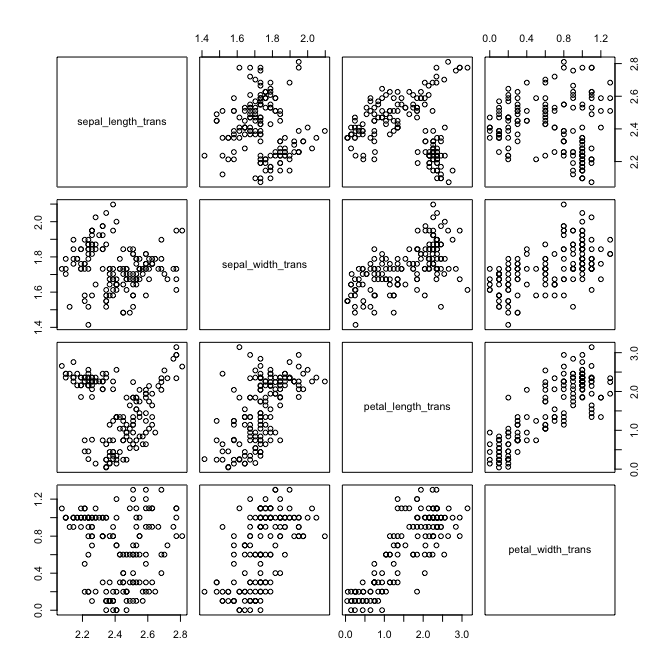
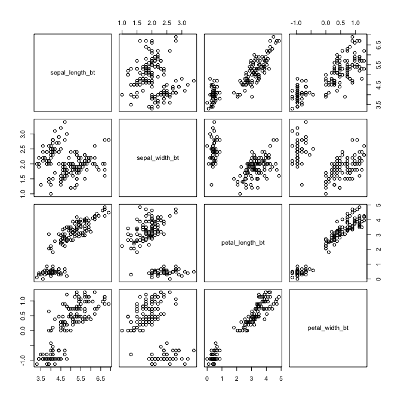
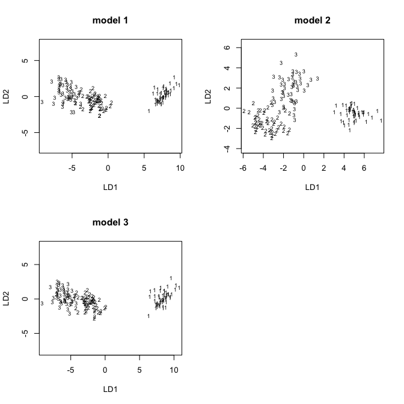
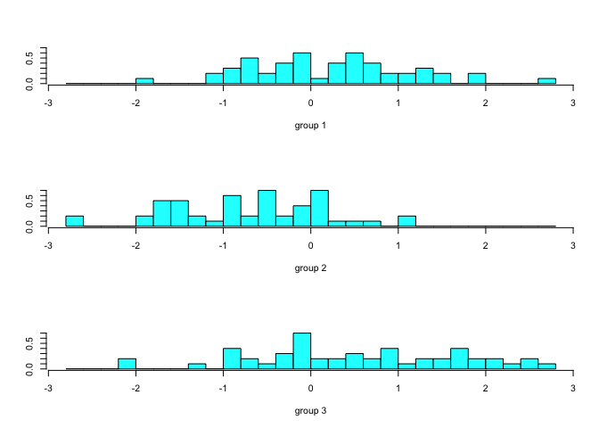

Info813 report week 5: Discriminant analysis on iris
====================================================

Problem statement
-----------------

Two questions will be answered in this report:

1.  Do the three species differ with respect to the four characteristics
    collected?
2.  How well is the model between the specimen and their attributes?

Data description
----------------

Iris dataset collected by Fisher is used, including 150 observations of
iris concerning the following 4 variables:

-   Length of sepal
-   Width of sepal
-   Length of petal
-   Width of petal

The observations are composed of 50 observations in each of the three
species. No name of the species is specified in the dataset.

Below is the head of this dataset.

    ##   species sepal_length sepal_width petal_length petal_width
    ## 1       1          5.1         3.5          1.4         0.2
    ## 2       1          4.9         3.0          1.4         0.2
    ## 3       1          4.7         3.2          1.3         0.2
    ## 4       1          4.6         3.1          1.5         0.2
    ## 5       1          5.0         3.6          1.4         0.2
    ## 6       1          5.4         3.9          1.7         0.4

Research method
---------------

Linear discriminant analysis method and a set of R packages connected
with this method are used in this report.

Results
-------

#### Distances between iris categories

The distance between the three categories in the dataset can be best
presented by the scatterplot matrices, which is plotted below. Blue dots
belong to catetory 1, red 2, and black 3. It is shown by this plot that
group 1 is almost always different than the other two groups on any
combination of two variables. Category 2 and 3 have strong similarities
in the two sepal-related variables. (In the following chart, **blue** is
group 1, **red** is group 2, and **black** is group 3.)

<!-- -->

#### Test of assumptions of the original dataset

The following four assumptions of linear discriminant analysis are
tested before the analysis:

1.  Outlier
2.  Homogeneity of variance
3.  Univariate normality
4.  Multivariate normality

###### 1. Outliers

According to the scatterplot matrice, there is no obvious outliers that
can be identified in the dataset. Even though category 1 is relatively
distant from the other two groups.

###### 2. Homogeneity of variance

Homogeneity of variance is tested using **test of variance homogeneity
of correlated variances** that is included the MVT package (version
0.3). However, since the p-value approximates 0, the null hypothesis
that the variances are homogeneous can be rejected. Thus, it could be a
problem to conduct linear discriminant analysis method.

    ## 
    ## Likelihood ratio test for equality of variances 
    ## 
    ## data: output 
    ## LRT statistic = 970.4401, df = 3, p-value = 0
    ## alternative hypothesis: true variances are not equal.
    ## 
    ## sample estimate:
    ##              sepal_length sepal_width petal_length petal_width
    ## sepal_length  0.68564773                                      
    ## sepal_width  -0.04508295   0.18933964                         
    ## petal_length  1.27895734  -0.33427897  3.13303165             
    ## petal_width   0.51869129  -0.12348804  1.30319975   0.58389557

###### 3. Univariate normality

uniNorm function in MVN package (version 4.0) is used to test the
univariate normality of the dataset. The core of this function are a
descriptive analysis as well as the Shapiro-wilk's Normality test.
According to the latter, all variables but sepal\_width fail to pass
this test.

    ## $`Descriptive Statistics`
    ##                n  Mean Std.Dev Median Min Max 25th 75th   Skew Kurtosis
    ## sepal_length 150 5.843   0.828   5.80 4.3 7.9  5.1  6.4  0.309   -0.606
    ## sepal_width  150 3.057   0.436   3.00 2.0 4.4  2.8  3.3  0.313    0.139
    ## petal_length 150 3.758   1.765   4.35 1.0 6.9  1.6  5.1 -0.269   -1.417
    ## petal_width  150 1.199   0.762   1.30 0.1 2.5  0.3  1.8 -0.101   -1.358
    ## 
    ## $`Shapiro-Wilk's Normality Test`
    ##       Variable Statistic   p-value Normality
    ## 1 sepal_length    0.9761    0.0102    NO    
    ## 2 sepal_width     0.9849    0.1012    YES   
    ## 3 petal_length    0.8763    0.0000    NO    
    ## 4 petal_width     0.9018    0.0000    NO

Among the four variables, two petal-related variables are highly
unevenly distributed, as plotted in the histograms below:

<!-- -->

###### 4. Multivariate normality

Mardia’s Multivariate Normality Test as included in the MVN package is
used. Similarly, the multivariate normality test is not passed as well.

    ##    Mardia's Multivariate Normality Test 
    ## --------------------------------------- 
    ##    data : output[, 2:5] 
    ## 
    ##    g1p            : 2.69722 
    ##    chi.skew       : 67.43051 
    ##    p.value.skew   : 4.757998e-07 
    ## 
    ##    g2p            : 23.73966 
    ##    z.kurtosis     : -0.2301121 
    ##    p.value.kurt   : 0.8180047 
    ## 
    ##    chi.small.skew : 69.33009 
    ##    p.value.small  : 2.342108e-07 
    ## 
    ##    Result          : Data are not multivariate normal. 
    ## ---------------------------------------

#### Transformed dataset and assumption test

Two types of transformation were done to address to the problems
identified above. First, to mitigate violation to the univariate
normality, transformation was conducted to both petal-related variables
using **the absolute value of the difference between observation and the
mean value of the variable**, because of the bimodality in both
variables. For the two sepal variables, **square root** is applied.

Moreover, after the first transformation, Box-Cox power transformation
is applied to the transformed variables. The three sets of variables
will be compared in the later sections.

    ## bcPower Transformations to Multinormality 
    ## 
    ##                    Est.Power Std.Err. Wald Lower Bound Wald Upper Bound
    ## sepal_length_trans    0.6997   0.8705          -1.0064           2.4059
    ## sepal_width_trans     1.3020   0.7400          -0.1484           2.7525
    ## petal_length_trans    0.8423   0.0710           0.7030           0.9815
    ## petal_width_trans     0.7109   0.0550           0.6032           0.8186
    ## 
    ## Likelihood ratio tests about transformation parameters
    ##                                           LRT df         pval
    ## LR test, lambda = (0 0 0 0)       478.8533492  4 0.000000e+00
    ## LR test, lambda = (1 1 1 1)        24.3582817  4 6.769451e-05
    ## LR test, lambda = (1 1 0.84 0.71)   0.2777058  4 9.912075e-01

    ##                                         LRT df      pval
    ## LR test, lambda = (1 1 0.84 0.71) 0.2827988  4 0.9908973

And then, the assumption tests were conducted again using the 2 sets of
new variables.

###### 1. Outliers

Similar with the original data, no outlier is identified in the dataset.

<!-- --><!-- -->

###### 2. Homogeneity of variance

However, even after both transformations, the variance still cannot pass
the homogeneity test.

    ## 
    ## Likelihood ratio test for equality of variances 
    ## 
    ## data: output 
    ## LRT statistic = 902.4816, df = 3, p-value = 0
    ## alternative hypothesis: true variances are not equal.
    ## 
    ## sample estimate:
    ##                    sepal_length_trans sepal_width_trans petal_length_trans
    ## sepal_length_trans  0.028905005                                           
    ## sepal_width_trans  -0.002495366        0.015408241                        
    ## petal_length_trans -0.014388366        0.061318098       0.656853206      
    ## petal_width_trans  -0.008796273        0.027164911       0.262571384      
    ##                    petal_width_trans
    ## sepal_length_trans                  
    ## sepal_width_trans                   
    ## petal_length_trans                  
    ## petal_width_trans   0.145035332

    ## 
    ## Likelihood ratio test for equality of variances 
    ## 
    ## data: output 
    ## LRT statistic = 805.4957, df = 3, p-value = 0
    ## alternative hypothesis: true variances are not equal.
    ## 
    ## sample estimate:
    ##                 sepal_length_bt sepal_width_bt petal_length_bt
    ## sepal_length_bt  0.68337403                                   
    ## sepal_width_bt  -0.04356672      0.18887060                   
    ## petal_length_bt  1.05000681     -0.28252629     2.15158351    
    ## petal_width_bt   0.52488776     -0.13730683     1.10745469    
    ##                 petal_width_bt
    ## sepal_length_bt               
    ## sepal_width_bt                
    ## petal_length_bt               
    ## petal_width_bt   0.60492265

###### 3. Univariate normality

Similarly, the univariate normality test was also not passed by both
sets of variables, even though the latter set got better results.

    ## $`Descriptive Statistics`
    ##                      n  Mean Std.Dev Median   Min   Max  25th  75th   Skew
    ## sepal_length_trans 150 2.411   0.171  2.408 2.074 2.811 2.258 2.530  0.174
    ## sepal_width_trans  150 1.744   0.124  1.732 1.414 2.098 1.673 1.817  0.096
    ## petal_length_trans 150 1.563   0.811  1.792 0.042 3.142 0.842 2.258 -0.278
    ## petal_width_trans  150 0.658   0.381  0.799 0.001 1.301 0.301 0.999 -0.287
    ##                    Kurtosis
    ## sepal_length_trans   -0.718
    ## sepal_width_trans     0.028
    ## petal_length_trans   -1.236
    ## petal_width_trans    -1.379
    ## 
    ## $`Shapiro-Wilk's Normality Test`
    ##             Variable Statistic   p-value Normality
    ## 1 sepal_length_trans    0.9806    0.0328    NO    
    ## 2 sepal_width_trans     0.9896    0.3355    YES   
    ## 3 petal_length_trans    0.9304    0.0000    NO    
    ## 4 petal_width_trans     0.9011    0.0000    NO

    ## $`Descriptive Statistics`
    ##                   n  Mean Std.Dev Median    Min   Max   25th  75th   Skew
    ## sepal_length_bt 150 4.843   0.828  4.800  3.300 6.900  4.100 5.400  0.309
    ## sepal_width_bt  150 2.057   0.436  2.000  1.000 3.400  1.800 2.300  0.313
    ## petal_length_bt 150 2.373   1.467  2.908  0.000 4.853  0.577 3.496 -0.327
    ## petal_width_bt  150 0.108   0.778  0.288 -1.133 1.292 -0.809 0.730 -0.294
    ##                 Kurtosis
    ## sepal_length_bt   -0.606
    ## sepal_width_bt     0.139
    ## petal_length_bt   -1.436
    ## petal_width_bt    -1.388
    ## 
    ## $`Shapiro-Wilk's Normality Test`
    ##          Variable Statistic   p-value Normality
    ## 1 sepal_length_bt    0.9761    0.0102    NO    
    ## 2 sepal_width_bt     0.9849    0.1012    YES   
    ## 3 petal_length_bt    0.8677    0.0000    NO    
    ## 4 petal_width_bt     0.8862    0.0000    NO

###### 4. Multivariate normality

Last, Mardia’s Multivariate Normality Test was also not met by both sets
of variables.

    ##    Mardia's Multivariate Normality Test 
    ## --------------------------------------- 
    ##    data : output[, 2:5] 
    ## 
    ##    g1p            : 2.69722 
    ##    chi.skew       : 67.43051 
    ##    p.value.skew   : 4.757998e-07 
    ## 
    ##    g2p            : 23.73966 
    ##    z.kurtosis     : -0.2301121 
    ##    p.value.kurt   : 0.8180047 
    ## 
    ##    chi.small.skew : 69.33009 
    ##    p.value.small  : 2.342108e-07 
    ## 
    ##    Result          : Data are not multivariate normal. 
    ## ---------------------------------------

    ##    Mardia's Multivariate Normality Test 
    ## --------------------------------------- 
    ##    data : output[, 2:5] 
    ## 
    ##    g1p            : 2.69722 
    ##    chi.skew       : 67.43051 
    ##    p.value.skew   : 4.757998e-07 
    ## 
    ##    g2p            : 23.73966 
    ##    z.kurtosis     : -0.2301121 
    ##    p.value.kurt   : 0.8180047 
    ## 
    ##    chi.small.skew : 69.33009 
    ##    p.value.small  : 2.342108e-07 
    ## 
    ##    Result          : Data are not multivariate normal. 
    ## ---------------------------------------

So even though eventually the dataset failed to pass the assumption
test, the descriminant analysis was still conducted over the three sets
of variables to compare the results. Even though there is a high risk
that the results might not be accurate.

#### Results

Function "lda" was used in the "MASS" package to establish the linear
discriminant analysis model. Two similar models were established using
the two transformed set of variables.

    lda.model_1 <- lda(species ~ sepal_length + sepal_width + petal_length + petal_width, 
                       data = output, CV = T)

Below is the scatterplot of the original dataset on the two linear
discriminants.

<!-- -->

Another way to look at the distance between the three categories is
through histogram on the linear discriminant. Below is the historgram of
the three categories on the two discriminants base on model 1.

<!-- --><!-- -->

Quite similar with the visual clue, model 1 and model 3 have the same
accuracy rate, which is higher than that of model 2.

    ## 
    ## ------------------
    ##  Model   Accuracy 
    ## ------- ----------
    ## model 1    0.98   
    ## 
    ## model 2    0.96   
    ## 
    ## model 3    0.98   
    ## ------------------
    ## 
    ## Table: Table of accuracy rate comparison

Conclusions
-----------

It can be concluded that even though the dataset might not be
appropriate for discriminant analysis, the original model is quite
accurate. And transforming the data doesn't help to increase the
performance of the model.

And group 2 and group 3 are more similar with each other than with group
1.
