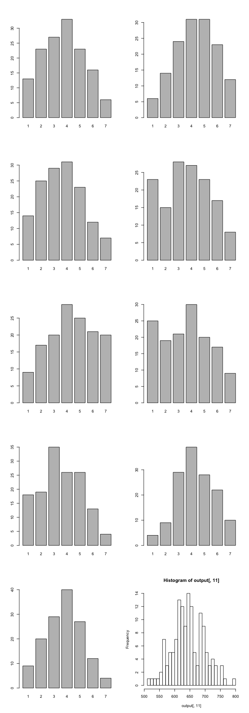

Report 8: Structural equation models for math attitudes
=======================================================

Question statement
------------------

A researcher is studying the impact of students' attitudes toward math
on their evaluations of a new quantitative methods course.

1.  How would you evaluate the adequacy of the researcher's measurement
    of attitudes?
2.  Test the hypothesis that there is no effect of attitudes on
    students' evaluation of the new quantitative course, controlling for
    the effect of student aptitude.

Methods
-------

Structural equation models method is used in this report.

Data description
----------------

Besides the students' ID, the dataset includes the following four sets
of measurements:

**Students' attitudes toward math**: the authors used three seven-point
semantic differential scales of nervous-confident, capable-inept,
angry-happy. The researcher conducted the same survey twice at the
beginnings of two terms, which creates the following variables:

-   nervous-confident (X1 and X1a)
-   capable-inept (X2 and X2a)
-   angry-happy (X3 and X3a)

**Students' evaluation of the quantitative course**: using three
seven-point Likert scale (1: strongly disagree; 7: strongly agree), the
students rated the following three statements:

-   "I will be able to use what I learned in this course" (Y1)
-   "The subject matter of this course was not relevant to me" (Y2)
-   "This was a great course" (Y3)

**Students' scores of an aptitude test**: (score)

Below is the head of the dataset.

    ##     ID X1 X2 X3 X1a X2a X3a Y1 Y2 Y3 score
    ## 1 1001  6  3  3   4   5   1  1  7  1   624
    ## 2 1002  4  4  4   4   3   5  2  4  3   616
    ## 3 1003  4  5  5   4   4   5  4  3  4   764
    ## 4 1004  3  5  3   4   4   4  1  6  2   630
    ## 5 1005  2  5  3   1   6   2  5  6  5   685
    ## 6 1006  2  5  1   2   5   1  2  4  4   626

Results
-------

#### Descriptive analysis

Below is the bar charts/histograms of all the measurement variables. All
the scale test results are treated as nominal data.

#### SEM modelling

Based on the research design and research questions, the following model
is established:

    model <- "
      # measurement model
      att1 =~ X1 + X2 + X3
      att2 =~ X1a + X2a + X3a
      eval =~ Y1 + Y2 + Y3

      # regression model
      att2 ~ att1
      eval ~ att1 + att2

      # residuals variance
      X1 ~~ X1a
      X2 ~~ X2a
      X3 ~~ X3a

    "

    ## Found more than one class "Model" in cache; using the first, from namespace 'lavaan'

    ## lavaan (0.5-20) converged normally after  52 iterations
    ## 
    ##   Number of observations                           141
    ## 
    ##   Estimator                                         ML
    ##   Minimum Function Test Statistic               13.787
    ##   Degrees of freedom                                21
    ##   P-value (Chi-square)                           0.879
    ## 
    ## Parameter Estimates:
    ## 
    ##   Information                                 Expected
    ##   Standard Errors                             Standard
    ## 
    ## Latent Variables:
    ##                    Estimate  Std.Err  Z-value  P(>|z|)   Std.lv  Std.all
    ##   att1 =~                                                               
    ##     X1                1.000                               1.240    0.799
    ##     X2               -0.993    0.076  -12.996    0.000   -1.231   -0.774
    ##     X3                1.055    0.080   13.266    0.000    1.308    0.774
    ##   att2 =~                                                               
    ##     X1a               1.000                               1.511    0.874
    ##     X2a              -1.035    0.054  -19.030    0.000   -1.564   -0.876
    ##     X3a               1.033    0.056   18.600    0.000    1.562    0.834
    ##   eval =~                                                               
    ##     Y1                1.000                               1.374    0.861
    ##     Y2               -0.710    0.098   -7.243    0.000   -0.975   -0.675
    ##     Y3                0.765    0.101    7.596    0.000    1.051    0.729
    ## 
    ## Regressions:
    ##                    Estimate  Std.Err  Z-value  P(>|z|)   Std.lv  Std.all
    ##   att2 ~                                                                
    ##     att1              1.024    0.071   14.336    0.000    0.840    0.840
    ##   eval ~                                                                
    ##     att1              0.565    0.199    2.844    0.004    0.510    0.510
    ##     att2             -0.122    0.154   -0.796    0.426   -0.135   -0.135
    ## 
    ## Covariances:
    ##                    Estimate  Std.Err  Z-value  P(>|z|)   Std.lv  Std.all
    ##   X1 ~~                                                                 
    ##     X1a               0.687    0.133    5.174    0.000    0.687    0.877
    ##   X2 ~~                                                                 
    ##     X2a               0.770    0.144    5.356    0.000    0.770    0.886
    ##   X3 ~~                                                                 
    ##     X3a               1.032    0.170    6.085    0.000    1.032    0.933
    ## 
    ## Variances:
    ##                    Estimate  Std.Err  Z-value  P(>|z|)   Std.lv  Std.all
    ##     X1                0.869    0.156    5.573    0.000    0.869    0.361
    ##     X2                1.016    0.170    5.992    0.000    1.016    0.401
    ##     X3                1.147    0.190    6.024    0.000    1.147    0.401
    ##     X1a               0.706    0.130    5.428    0.000    0.706    0.236
    ##     X2a               0.743    0.139    5.331    0.000    0.743    0.233
    ##     X3a               1.069    0.168    6.372    0.000    1.069    0.305
    ##     Y1                0.657    0.209    3.152    0.002    0.657    0.258
    ##     Y2                1.134    0.169    6.713    0.000    1.134    0.544
    ##     Y3                0.976    0.164    5.955    0.000    0.976    0.469
    ##     att1              1.538    0.259    5.942    0.000    1.000    1.000
    ##     att2              0.671    0.098    6.859    0.000    0.294    0.294
    ##     eval              1.580    0.311    5.078    0.000    0.837    0.837

Below are some of the key numbers of this model. The high p-value, CFI,
and TLI values and low RMSEA value suggest that this model is solid.
Moreover, according to the results displayed above, there seems to be a
strong connection between the two attitude surveys; while even though
the first survey has a somewhat strong connection with the students'
evaluation, the second one is much more weakly connected.

More importantly, all of the three questions seem to have high
coefficients and Z-values in the overall survey design, suggesting a
high level of adequacy of the survey questions.

<table style="width:26%;">
<colgroup>
<col width="15%" />
<col width="11%" />
</colgroup>
<thead>
<tr class="header">
<th align="center">Measures</th>
<th align="center">Values</th>
</tr>
</thead>
<tbody>
<tr class="odd">
<td align="center">p.value</td>
<td align="center">0.8786</td>
</tr>
<tr class="even">
<td align="center">CFI</td>
<td align="center">1</td>
</tr>
<tr class="odd">
<td align="center">TLI</td>
<td align="center">1.01</td>
</tr>
<tr class="even">
<td align="center">RMSEA</td>
<td align="center">0</td>
</tr>
</tbody>
</table>

#### Controlling for the effect of students' aptitude

According to the results in the last section, there seems to be a *not
so strong* connection between students' evaluation and their first
attitude test, but no significant connection between the evaluation and
the second test.

In order to rule out the effects of students' aptitude on their
evaluation, all the students are randomly split into two groups. The
sample size and the mean test scores are shown below.

    ## List of 2
    ##  $ set1:'data.frame':    70 obs. of  11 variables:
    ##   ..$ ID   : Factor w/ 141 levels "1001","1002",..: 139 58 60 140 59 121 1 11 39 102 ...
    ##   ..$ X1   : num [1:70] 6 4 4 4 5 1 6 6 6 4 ...
    ##   ..$ X2   : num [1:70] 2 4 6 3 1 7 3 2 2 5 ...
    ##   ..$ X3   : num [1:70] 4 3 2 4 7 1 3 7 7 4 ...
    ##   ..$ X1a  : num [1:70] 7 4 3 5 6 1 4 5 6 5 ...
    ##   ..$ X2a  : num [1:70] 2 4 7 2 1 7 5 3 2 4 ...
    ##   ..$ X3a  : num [1:70] 4 4 1 5 7 1 1 6 7 4 ...
    ##   ..$ Y1   : num [1:70] 5 6 4 5 2 3 1 7 3 5 ...
    ##   ..$ Y2   : num [1:70] 3 3 4 3 6 3 7 3 5 4 ...
    ##   ..$ Y3   : num [1:70] 5 5 4 4 3 5 1 7 5 5 ...
    ##   ..$ score: num [1:70] 614 730 732 722 635 678 624 646 625 643 ...
    ##  $ set2:'data.frame':    71 obs. of  11 variables:
    ##   ..$ ID   : Factor w/ 141 levels "1001","1002",..: 5 8 12 13 15 16 19 20 21 22 ...
    ##   ..$ X1   : num [1:71] 2 5 7 3 2 5 4 5 6 4 ...
    ##   ..$ X2   : num [1:71] 5 4 3 4 5 4 5 4 5 4 ...
    ##   ..$ X3   : num [1:71] 3 6 6 4 2 5 2 4 4 4 ...
    ##   ..$ X1a  : num [1:71] 1 6 7 1 2 5 5 4 5 4 ...
    ##   ..$ X2a  : num [1:71] 6 3 2 5 6 4 4 4 6 3 ...
    ##   ..$ X3a  : num [1:71] 2 7 7 2 1 5 3 4 3 4 ...
    ##   ..$ Y1   : num [1:71] 5 3 5 5 2 3 5 5 1 4 ...
    ##   ..$ Y2   : num [1:71] 6 4 2 6 5 5 3 2 7 3 ...
    ##   ..$ Y3   : num [1:71] 5 5 5 4 3 5 5 4 2 4 ...
    ##   ..$ score: num [1:71] 685 604 687 704 591 684 610 631 605 655 ...

    ## $set1
    ## [1] 70
    ## 
    ## $set2
    ## [1] 71

    ## $set1
    ##       ID X1 X2 X3 X1a X2a X3a Y1 Y2 Y3 score
    ## 139 1139  6  2  4   7   2   4  5  3  5   614
    ## 58  1058  4  4  3   4   4   4  6  3  5   730
    ## 60  1060  4  6  2   3   7   1  4  4  4   732
    ## 140 1140  4  3  4   5   2   5  5  3  4   722
    ## 59  1059  5  1  7   6   1   7  2  6  3   635
    ## 121 1121  1  7  1   1   7   1  3  3  5   678
    ## 
    ## $set2
    ##      ID X1 X2 X3 X1a X2a X3a Y1 Y2 Y3 score
    ## 5  1005  2  5  3   1   6   2  5  6  5   685
    ## 8  1008  5  4  6   6   3   7  3  4  5   604
    ## 12 1012  7  3  6   7   2   7  5  2  5   687
    ## 13 1013  3  4  4   1   5   2  5  6  4   704
    ## 15 1015  2  5  2   2   6   1  2  5  3   591
    ## 16 1016  5  4  5   5   4   5  3  5  5   684

<table style="width:38%;">
<colgroup>
<col width="8%" />
<col width="12%" />
<col width="16%" />
</colgroup>
<thead>
<tr class="header">
<th align="center">Set</th>
<th align="center">Sample</th>
<th align="center">Mean.score</th>
</tr>
</thead>
<tbody>
<tr class="odd">
<td align="center">Set 1</td>
<td align="center">70</td>
<td align="center">647.5</td>
</tr>
<tr class="even">
<td align="center">Set 2</td>
<td align="center">71</td>
<td align="center">642.5</td>
</tr>
</tbody>
</table>

Then the above SEM model was applied to both subsets. Below are the
summaries of the results of the overall model and the relationships
between students' attitudes and evaluations.

<table>
<caption>Table continues below</caption>
<colgroup>
<col width="7%" />
<col width="12%" />
<col width="7%" />
<col width="7%" />
<col width="9%" />
<col width="20%" />
<col width="17%" />
<col width="17%" />
</colgroup>
<thead>
<tr class="header">
<th align="center">Set</th>
<th align="center">p.value</th>
<th align="center">CFI</th>
<th align="center">TLI</th>
<th align="center">RMSEA</th>
<th align="center">Att1.Eval.coef</th>
<th align="center">Att1.Eval.z</th>
<th align="center">Att1.Eval.p</th>
</tr>
</thead>
<tbody>
<tr class="odd">
<td align="center">Whole</td>
<td align="center">0.879</td>
<td align="center">1</td>
<td align="center">1.01</td>
<td align="center">0</td>
<td align="center">0.565</td>
<td align="center">2.844</td>
<td align="center">0.004</td>
</tr>
<tr class="even">
<td align="center">Set 1</td>
<td align="center">0.232</td>
<td align="center">0.993</td>
<td align="center">0.988</td>
<td align="center">0.054</td>
<td align="center">0.684</td>
<td align="center">2.339</td>
<td align="center">0.019</td>
</tr>
<tr class="odd">
<td align="center">Set 2</td>
<td align="center">0.525</td>
<td align="center">1</td>
<td align="center">1.003</td>
<td align="center">0</td>
<td align="center">0.46</td>
<td align="center">1.663</td>
<td align="center">0.096</td>
</tr>
</tbody>
</table>

<table style="width:62%;">
<colgroup>
<col width="23%" />
<col width="19%" />
<col width="19%" />
</colgroup>
<thead>
<tr class="header">
<th align="center">Att2.Eval.coef</th>
<th align="center">Att2.Eval.z</th>
<th align="center">Att2.Eval.p</th>
</tr>
</thead>
<tbody>
<tr class="odd">
<td align="center">-0.122</td>
<td align="center">-0.796</td>
<td align="center">0.426</td>
</tr>
<tr class="even">
<td align="center">-0.156</td>
<td align="center">-0.601</td>
<td align="center">0.548</td>
</tr>
<tr class="odd">
<td align="center">-0.085</td>
<td align="center">-0.47</td>
<td align="center">0.638</td>
</tr>
</tbody>
</table>

The results indicate that the overall validity of the model doesn't
change significantly after it's applied to a subset of the dataset; so
is the relationship between the two attitude surveys and the course
evaluation: **there doesn't seem to have a solid strong effect of
attitude toward the evaluation**. Based on the results, the relationship
is either coincidental or weak.

Conclusions
-----------

This report shows that the three questions in the survey have a high
level of adequacy given their consistencies in the two rounds of
responses received.

Moreover, there doesn't seem to be a strong effect of attitudes toward
the evaluation of the course when the student aptitude in math is
controlled.
