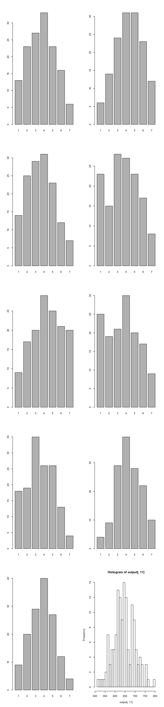

Report 8: Structural equation models for math attitudes
=======================================================

Question statement
------------------

A researcher is studying the impact of students' attitudes toward math
on their evaluations of a new quantitative methods course.

1.  How would you evaluate the adequacy of the researcher's measurement
    of attitude toward math?
2.  Test the hypothesis that there is no effect of attitude toward math
    on students' evaluation of the new quantitative course, controlling
    for the effect of student aptitude.

Methods
-------

Structural equation models method is used in this report.

Data description
----------------

Besides the students' ID, the dataset includes the following four sets
of measurements:

**Students' attitudes toward math**: the authors used three seven-point
semantic differential scales of nervous-confident, capable-inept,
angry-happy. For all of the three scales, the research tested twice at
the beginnings of two terms. It includes the following variables:

-   X1
-   X2
-   X3
-   X1a
-   X2a
-   X3a

**Students' evaluation of the quantitative course**: using three
seven-point Likert scale (1: strongly disagree; 7: strongly agree), the
author asked the following three questions to the students:

-   "I will be able to use what I learned in this course" (Y1)
-   "The subject matter of this course was not relevant to me" (Y2)
-   "This was a great course" (Y3)

**Students' scores of a aptitude test**: (score)

The dataset includes the responses and scores of 141 students.

Results
-------

#### Descriptive analysis

Below is the bar charts/histograms of all the measurement variables.

#### SEM modelling

Based on the research design and research questions, the following model
is established:

    ## Found more than one class "Model" in cache; using the first, from namespace 'lavaan'

    ## lavaan (0.5-20) converged normally after  39 iterations
    ## 
    ##   Number of observations                           141
    ## 
    ##   Estimator                                         ML
    ##   Minimum Function Test Statistic               33.807
    ##   Degrees of freedom                                30
    ##   P-value (Chi-square)                           0.289
    ## 
    ## Parameter Estimates:
    ## 
    ##   Information                                 Expected
    ##   Standard Errors                             Standard
    ## 
    ## Latent Variables:
    ##                    Estimate  Std.Err  Z-value  P(>|z|)   Std.lv  Std.all
    ##   att1 =~                                                               
    ##     X1                1.000                               1.217    0.773
    ##     X2               -1.007    0.074  -13.693    0.000   -1.225   -0.775
    ##     X3                1.069    0.074   14.538    0.000    1.301    0.793
    ##   att2 =~                                                               
    ##     X1a               1.000                               1.471    0.827
    ##     X2a              -1.043    0.060  -17.283    0.000   -1.535   -0.838
    ##     X3a               1.057    0.059   17.999    0.000    1.555    0.841
    ##   eval =~                                                               
    ##     Y1                1.000                               1.283    0.789
    ##     Y2               -0.797    0.094   -8.483    0.000   -1.022   -0.715
    ##     Y3                0.828    0.095    8.683    0.000    1.062    0.728
    ## 
    ## Regressions:
    ##                    Estimate  Std.Err  Z-value  P(>|z|)   Std.lv  Std.all
    ##   att2 ~                                                                
    ##     att1              1.008    0.071   14.260    0.000    0.834    0.834
    ##   eval ~                                                                
    ##     att1              0.500    0.188    2.660    0.008    0.475    0.475
    ##     att2             -0.078    0.148   -0.524    0.600   -0.089   -0.089
    ## 
    ## Covariances:
    ##                    Estimate  Std.Err  Z-value  P(>|z|)   Std.lv  Std.all
    ##   X1 ~~                                                                 
    ##     X1a               0.897    0.017   51.275    0.000    0.897    0.897
    ##   X2 ~~                                                                 
    ##     X2a               0.888    0.019   47.396    0.000    0.888    0.888
    ##   X3 ~~                                                                 
    ##     X3a               0.928    0.016   56.712    0.000    0.928    0.928
    ## 
    ## Variances:
    ##                    Estimate  Std.Err  Z-value  P(>|z|)   Std.lv  Std.all
    ##     X1                1.000                               1.000    0.403
    ##     X2                1.000                               1.000    0.400
    ##     X3                1.000                               1.000    0.371
    ##     X1a               1.000                               1.000    0.316
    ##     X2a               1.000                               1.000    0.298
    ##     X3a               1.000                               1.000    0.293
    ##     Y1                1.000                               1.000    0.378
    ##     Y2                1.000                               1.000    0.489
    ##     Y3                1.000                               1.000    0.470
    ##     att1              1.481    0.248    5.970    0.000    1.000    1.000
    ##     att2              0.657    0.097    6.759    0.000    0.304    0.304
    ##     eval              1.377    0.270    5.107    0.000    0.837    0.837

Below are some of the key numbers of this model. The high p-value, CFI,
and TLI values and low RMSEA value suggest that this model is solid.
Moreover, according to the results displayed above, there seems to be a
strong connection between the two attitude surveys; while even though
the first survey has a somewhat strong connection with the students'
evaluation, the second one is much more weakly connected.

More importantly, all of the three questions seem to have high
coefficients and Z-values in the overall survey design, suggesting a
high level of adequacy of the survey questions.

<table style="width:26%;">
<colgroup>
<col width="15%" />
<col width="11%" />
</colgroup>
<thead>
<tr class="header">
<th align="center">Measures</th>
<th align="center">Values</th>
</tr>
</thead>
<tbody>
<tr class="odd">
<td align="center">p.value</td>
<td align="center">0.2886</td>
</tr>
<tr class="even">
<td align="center">CFI</td>
<td align="center">0.9968</td>
</tr>
<tr class="odd">
<td align="center">TLI</td>
<td align="center">0.9961</td>
</tr>
<tr class="even">
<td align="center">RMSEA</td>
<td align="center">0.03</td>
</tr>
</tbody>
</table>

#### Controlling for the effect of students' aptitude

According to the results in the last section, there seems to be a *not
so strong* connection between students' evaluation and their first
attitude test, but no significant connection between the evaluation and
the second test.

In order to rule out the effects of students' aptitude on their
evaluation, all the students are randomly splitted into two groups. The
sample size and the mean test scores are shown below.

    ## List of 2
    ##  $ set1:'data.frame':    70 obs. of  11 variables:
    ##   ..$ ID   : Factor w/ 141 levels "1001","1002",..: 139 58 60 140 59 121 1 11 39 102 ...
    ##   ..$ X1   : num [1:70] 6 4 4 4 5 1 6 6 6 4 ...
    ##   ..$ X2   : num [1:70] 2 4 6 3 1 7 3 2 2 5 ...
    ##   ..$ X3   : num [1:70] 4 3 2 4 7 1 3 7 7 4 ...
    ##   ..$ X1a  : num [1:70] 7 4 3 5 6 1 4 5 6 5 ...
    ##   ..$ X2a  : num [1:70] 2 4 7 2 1 7 5 3 2 4 ...
    ##   ..$ X3a  : num [1:70] 4 4 1 5 7 1 1 6 7 4 ...
    ##   ..$ Y1   : num [1:70] 5 6 4 5 2 3 1 7 3 5 ...
    ##   ..$ Y2   : num [1:70] 3 3 4 3 6 3 7 3 5 4 ...
    ##   ..$ Y3   : num [1:70] 5 5 4 4 3 5 1 7 5 5 ...
    ##   ..$ score: num [1:70] 614 730 732 722 635 678 624 646 625 643 ...
    ##  $ set2:'data.frame':    71 obs. of  11 variables:
    ##   ..$ ID   : Factor w/ 141 levels "1001","1002",..: 5 8 12 13 15 16 19 20 21 22 ...
    ##   ..$ X1   : num [1:71] 2 5 7 3 2 5 4 5 6 4 ...
    ##   ..$ X2   : num [1:71] 5 4 3 4 5 4 5 4 5 4 ...
    ##   ..$ X3   : num [1:71] 3 6 6 4 2 5 2 4 4 4 ...
    ##   ..$ X1a  : num [1:71] 1 6 7 1 2 5 5 4 5 4 ...
    ##   ..$ X2a  : num [1:71] 6 3 2 5 6 4 4 4 6 3 ...
    ##   ..$ X3a  : num [1:71] 2 7 7 2 1 5 3 4 3 4 ...
    ##   ..$ Y1   : num [1:71] 5 3 5 5 2 3 5 5 1 4 ...
    ##   ..$ Y2   : num [1:71] 6 4 2 6 5 5 3 2 7 3 ...
    ##   ..$ Y3   : num [1:71] 5 5 5 4 3 5 5 4 2 4 ...
    ##   ..$ score: num [1:71] 685 604 687 704 591 684 610 631 605 655 ...

    ## $set1
    ## [1] 70
    ## 
    ## $set2
    ## [1] 71

    ## $set1
    ##       ID X1 X2 X3 X1a X2a X3a Y1 Y2 Y3 score
    ## 139 1139  6  2  4   7   2   4  5  3  5   614
    ## 58  1058  4  4  3   4   4   4  6  3  5   730
    ## 60  1060  4  6  2   3   7   1  4  4  4   732
    ## 140 1140  4  3  4   5   2   5  5  3  4   722
    ## 59  1059  5  1  7   6   1   7  2  6  3   635
    ## 121 1121  1  7  1   1   7   1  3  3  5   678
    ## 
    ## $set2
    ##      ID X1 X2 X3 X1a X2a X3a Y1 Y2 Y3 score
    ## 5  1005  2  5  3   1   6   2  5  6  5   685
    ## 8  1008  5  4  6   6   3   7  3  4  5   604
    ## 12 1012  7  3  6   7   2   7  5  2  5   687
    ## 13 1013  3  4  4   1   5   2  5  6  4   704
    ## 15 1015  2  5  2   2   6   1  2  5  3   591
    ## 16 1016  5  4  5   5   4   5  3  5  5   684

<table style="width:38%;">
<colgroup>
<col width="8%" />
<col width="12%" />
<col width="16%" />
</colgroup>
<thead>
<tr class="header">
<th align="center">Set</th>
<th align="center">Sample</th>
<th align="center">Mean.score</th>
</tr>
</thead>
<tbody>
<tr class="odd">
<td align="center">Set 1</td>
<td align="center">70</td>
<td align="center">647.5</td>
</tr>
<tr class="even">
<td align="center">Set 2</td>
<td align="center">71</td>
<td align="center">642.5</td>
</tr>
</tbody>
</table>

Then the above SEM model was applied to both subsets. Below are the
summaries of the results of the overall model and the relationships
between students' attitudes and evaluations.

<table>
<caption>Table continues below</caption>
<colgroup>
<col width="7%" />
<col width="12%" />
<col width="7%" />
<col width="7%" />
<col width="9%" />
<col width="20%" />
<col width="17%" />
<col width="17%" />
</colgroup>
<thead>
<tr class="header">
<th align="center">Set</th>
<th align="center">p.value</th>
<th align="center">CFI</th>
<th align="center">TLI</th>
<th align="center">RMSEA</th>
<th align="center">Att1.Eval.coef</th>
<th align="center">Att1.Eval.z</th>
<th align="center">Att1.Eval.p</th>
</tr>
</thead>
<tbody>
<tr class="odd">
<td align="center">Whole</td>
<td align="center">0.289</td>
<td align="center">0.997</td>
<td align="center">0.996</td>
<td align="center">0.03</td>
<td align="center">0.5</td>
<td align="center">2.66</td>
<td align="center">0.008</td>
</tr>
<tr class="even">
<td align="center">Set 1</td>
<td align="center">0.088</td>
<td align="center">0.983</td>
<td align="center">0.979</td>
<td align="center">0.072</td>
<td align="center">0.535</td>
<td align="center">1.889</td>
<td align="center">0.059</td>
</tr>
<tr class="odd">
<td align="center">Set 2</td>
<td align="center">0.569</td>
<td align="center">1</td>
<td align="center">1.004</td>
<td align="center">0</td>
<td align="center">0.437</td>
<td align="center">1.672</td>
<td align="center">0.095</td>
</tr>
</tbody>
</table>

<table style="width:62%;">
<colgroup>
<col width="23%" />
<col width="19%" />
<col width="19%" />
</colgroup>
<thead>
<tr class="header">
<th align="center">Att2.Eval.coef</th>
<th align="center">Att2.Eval.z</th>
<th align="center">Att2.Eval.p</th>
</tr>
</thead>
<tbody>
<tr class="odd">
<td align="center">-0.078</td>
<td align="center">-0.524</td>
<td align="center">0.6</td>
</tr>
<tr class="even">
<td align="center">-0.065</td>
<td align="center">-0.258</td>
<td align="center">0.797</td>
</tr>
<tr class="odd">
<td align="center">-0.065</td>
<td align="center">-0.366</td>
<td align="center">0.714</td>
</tr>
</tbody>
</table>

The results indicate that the overall validity of the model doesn't
change significantly after it's applied to a subset of the dataset; so
is the relationship between the two attitude surveys and the course
evaluation: **there doesn't seem to have a solid strong effect of
attitude toward the evaluation**.

Conclusions
-----------

This report shows that the three questions in the survey have a high
leve of adequency given their consistancies in the two rounds of
responces that were received.

Moreover, there doesn't seem to be a strong effect of attitude toward
the evaluation when the student eptitude in math is controlled, as is
seen by the results of the two subsets of the dataset.
