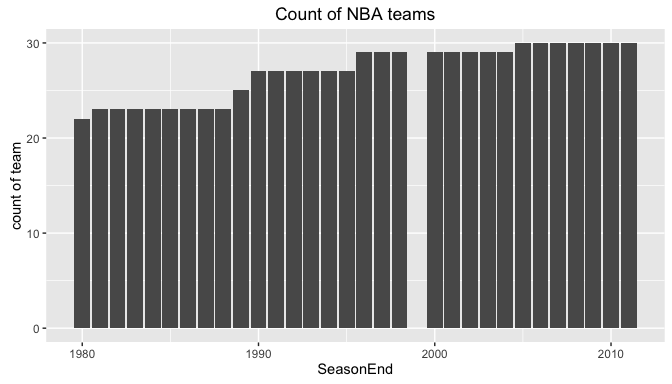
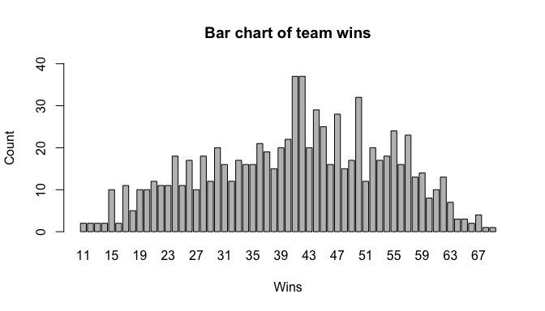
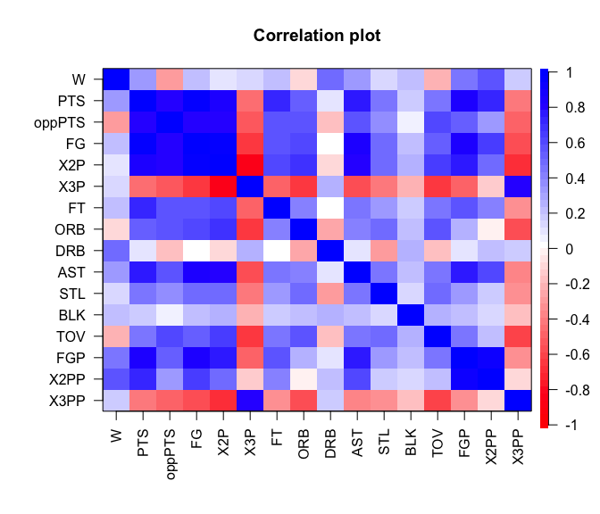
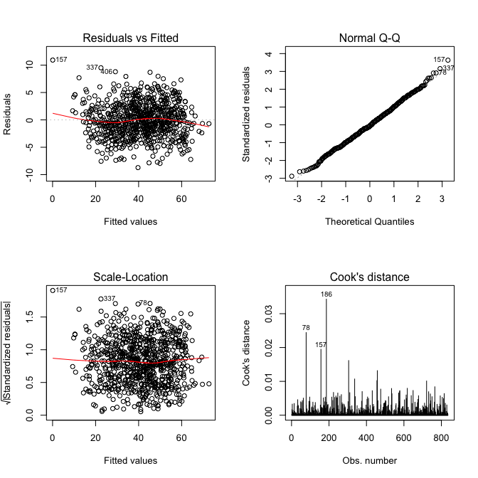
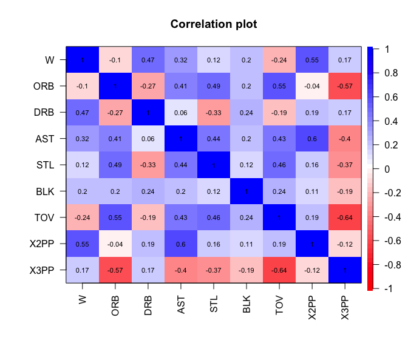
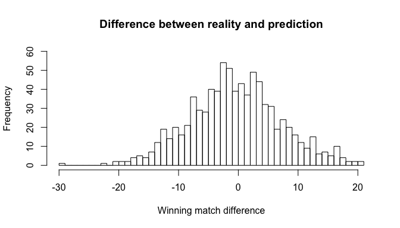
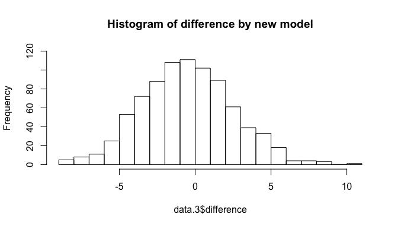
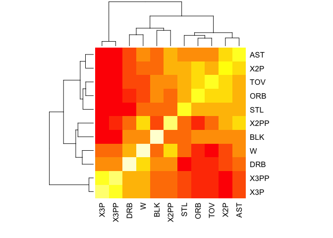
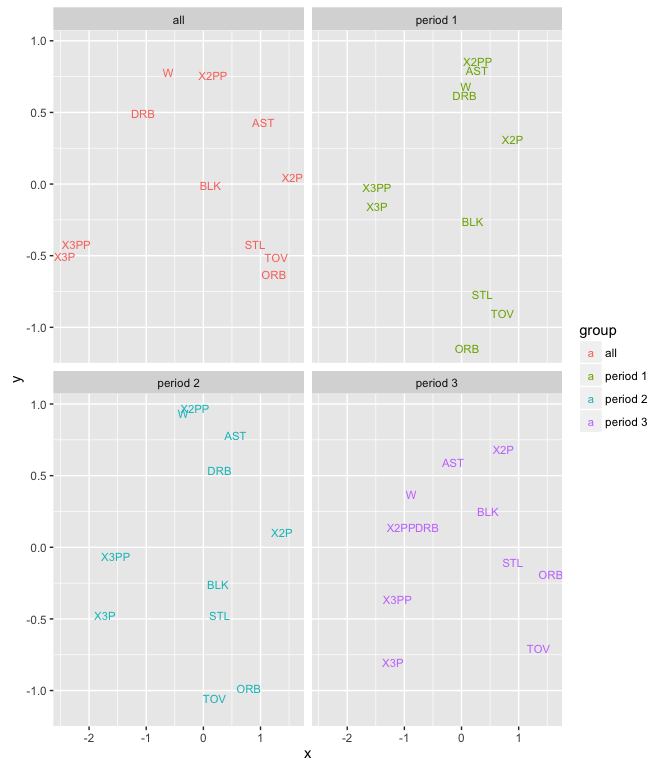
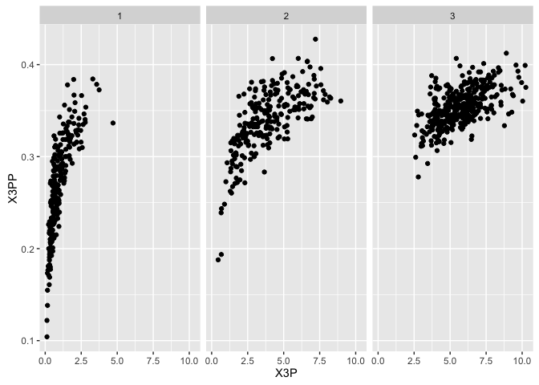

Final project: Regression and MDS analyses on NBA team stats
============================================================

Kai Li

6/1/2016

Research questions
------------------

1.  How well can the existing regular team stats help to predict winning
    matches of the NBA teams?
2.  How can we classify the measurements?

Data description
----------------

The dataset that is used in this study is the [NBA team stats
dataset](https://raw.githubusercontent.com/tyson-ni/nba/master/NBA_train.csv)
created by [Tyson Ni](https://github.com/tyson-ni/) and shared on
Github. It is not stated on the repository where the dataset was
originally from.

This dataset is entitled "NBA\_train" and is in CSV format. It includes
the basic statistics of all the NBA teams in the regular season games
from 1979-1980 to 2010-2011, excluding the shortened season of
1998-1999. Each of the 835 row is the performance of a team in a season.
22 variables are available in the dataset, including:

-   **SeasonEnd**: the end year of the season
-   **Team**: the name of the team
-   **Team.1**: the label of the team
-   **Franchise**: the franchise name of the team
-   **Playoffs**: whether the team entered playoffs in that season ("1":
    yes; "0": no)
-   **W**: number of games won (There have been 82 games in the regular
    season since the season of 1967-1968, except for the season of
    1998-1999, when there were 50 games, thanks to the lockout.)
-   **PTS**: total points made during the season
-   **oppPTS**: total points conceded during the season
-   **FG**: total field goals made during the season
-   **FGA**: total field goals attempted during the season
-   **2P**: 2-point goals made during the season
-   **2PA**: 2-point goals attempted during the season
-   **3P**: 3-point goals made during the season
-   **3PA**: 3-point goals attempted during the season
-   **FT**: free throws made during the season
-   **FTA**: free throws attempted during the season
-   **ORB**: total offensive rebounds during the season
-   **DRB**: total defensive rebounds during the season
-   **AST**: total assists during the season
-   **STL**: total steals during the season
-   **BLK**: total blocks during the season
-   **TOV**: total turnovers during the season

First, building upon these variables, some of other variables are
created based on the existing ones.

-   **absPTS**: the difference between points and opponent points
-   **FGP**: the percentage of field goals made to field goals attempted
-   **X2PP**: the percentage of 2-point goals made to 2-point goals
    attempted
-   **X3PP**: the percentage of 3-point goals made to 3-point goals
    attempted
-   **FTP**: the percentage of free throws made to free throws attempted

Second, all the variables that are total numbers rather than percentages
are further divided by 82 to be transformed from per season to per game
statistics.

Third, all the teams are separated into three groups by the season:

-   Group 1: 1980-1989
-   Group 2: 1990-1999
-   Group 3: 2000-2011

Analysis
--------

#### Descriptive analysis

Some basic descriptive analysis was conducted to the dataset. Below are
the change of the numbers of teams in the NBA league and the
distribution of the number of wins in each season in the dataset.

Below is the summary of the number of teams in the three time periods.

<table style="width:35%;">
<colgroup>
<col width="11%" />
<col width="13%" />
<col width="9%" />
</colgroup>
<thead>
<tr class="header">
<th align="center">Group</th>
<th align="center">Period</th>
<th align="center">Count</th>
</tr>
</thead>
<tbody>
<tr class="odd">
<td align="center">Group 1</td>
<td align="center">1980-1989</td>
<td align="center">231</td>
</tr>
<tr class="even">
<td align="center">Group 2</td>
<td align="center">1990-1999</td>
<td align="center">249</td>
</tr>
<tr class="odd">
<td align="center">Group 3</td>
<td align="center">2000-2011</td>
<td align="center">355</td>
</tr>
</tbody>
</table>

Thanks to the nature of the NBA games, a lot of the variables in the NBA
games are highly correlated, as shown below in the correlation matrix
based on all the numeric variables. Below is the correlation heatmap
based on a selection of variables. It is natural that FG- and
X2P-related variables are highly correlated with each other, both of
which are pretty strongly correlated with assists. On the other hand,
X3P-related variables seem to be the exceptions in this dataset.

#### Regression to predict winning match number

To predict the number of winning matches, a regression model is
established. Because of the highly correlated nature of the data,
variables that are highly correlated are not included in the data.

> model &lt;- lm(W ~ PTS + oppPTS + FG + X2P + ORB + DRB + AST + STL +
> BLK + TOV + FGP + X2PP + X3PP)

According to the diagnose diagram presented above, it seems that the
assumptions of regression analysis are largely met, including the
following:

-   **linearity assumption**: it is met because the dots seems to be
    relatively evenly distributed across the 0 line in Residuals vs.
    fitted plot;
-   **homoscenasticity assumption**: because the trend lines in both the
    Residuals vs. fitted plot and Scale-location plot are pretty
    straight parallel to the x-axis. Moreover, the results of
    Breusch-Pagan test also suggest that the null hypothesis of
    homoscedasticity cannot be rejected because of its p-value equals
    to 0.2417.
-   **normality assumption**: all the dots are plotted well in the QQ
    plot
-   **influential outliers**: based on Cook's distance plot, no
    observation is an influential outliers given their relatively
    low values.

Moreover, **independence assumption** is tested using Durbin-Watson
test. However, based on its result, the null hypothesis that the
observations are independent can be rejected at 0.05 level. The problem
is that I have selected a number of variables that are so strongly
correlated with each other.

    ## 
    ##  Durbin-Watson test
    ## 
    ## data:  lm
    ## DW = 1.8902, p-value = 0.03314
    ## alternative hypothesis: true autocorrelation is greater than 0

Last, **multicollinearity** is tested using variance inflation factors.
It seems that a number of independent variables violate this assumption
given their strong collinearity. Based on the result and the correlation
matrix above, **PTS**, **oppPTS**, **FG**, **X2P** (correlated with
PTS), and **FGP** (correlated with X2PP) are removed from the model.

    ##       PTS    oppPTS        FG       X2P       ORB       DRB       AST 
    ## 24.457361 13.561471 52.525985 67.909429  5.128571  3.015579  3.692757 
    ##       STL       BLK       TOV       FGP      X2PP      X3PP 
    ##  2.853408  1.269301  4.380553 71.262918 32.335232  3.754637

Based on the results from the assumption tests, the following model is
proposed and tested against the assumptions.

> model.1 &lt;- glm(W ~ ORB + DRB + AST + STL + BLK + TOV + X2PP + X3PP)

    ##      ORB      DRB      AST      STL      BLK      TOV     X2PP     X3PP 
    ## 2.088187 1.397657 2.436624 1.676751 1.204133 2.063367 1.870642 1.959008

According to the result, this model is able to interpret about 63% of
the variance in the dataset.

    ## 
    ## Call:
    ## lm(formula = W ~ ORB + DRB + AST + STL + BLK + TOV + X2PP + X3PP, 
    ##     data = data.1)
    ## 
    ## Residuals:
    ##      Min       1Q   Median       3Q      Max 
    ## -29.6365  -5.0685  -0.3044   4.6605  21.2279 
    ## 
    ## Coefficients:
    ##               Estimate Std. Error t value Pr(>|t|)    
    ## (Intercept) -2.150e+02  1.048e+01 -20.517  < 2e-16 ***
    ## ORB          1.062e+00  2.102e-01   5.051 5.41e-07 ***
    ## DRB          3.112e+00  1.977e-01  15.740  < 2e-16 ***
    ## AST         -6.228e-03  1.539e-01  -0.040  0.96773    
    ## STL          3.601e+00  3.030e-01  11.886  < 2e-16 ***
    ## BLK          1.406e+00  2.914e-01   4.826 1.66e-06 ***
    ## TOV         -3.166e+00  2.039e-01 -15.531  < 2e-16 ***
    ## X2PP         3.249e+02  1.809e+01  17.965  < 2e-16 ***
    ## X3PP         2.166e+01  7.208e+00   3.005  0.00273 ** 
    ## ---
    ## Signif. codes:  0 '***' 0.001 '**' 0.01 '*' 0.05 '.' 0.1 ' ' 1
    ## 
    ## Residual standard error: 7.696 on 826 degrees of freedom
    ## Multiple R-squared:  0.6387, Adjusted R-squared:  0.6352 
    ## F-statistic: 182.5 on 8 and 826 DF,  p-value: < 2.2e-16

The model is used to predict the winning matches.

###### Another approach:

Function *stepAIC* from the package MASS could automatically calculate
the subset of a model with the smallest AIC value. As a result, I used
my initial model as the starting point:

> model &lt;- lm(W ~ PTS + oppPTS + FG + X2P + ORB + DRB + AST + STL +
> BLK + TOV + FGP + X2PP + X3PP)

    ## Start:  AIC=1870.76
    ## W ~ PTS + oppPTS + FG + X2P + ORB + DRB + AST + STL + BLK + TOV + 
    ##     FGP + X2PP + X3PP
    ## 
    ##          Df Sum of Sq     RSS    AIC
    ## - FGP     1       0.1  7588.2 1868.8
    ## - X2P     1       0.7  7588.8 1868.8
    ## - FG      1       3.3  7591.4 1869.1
    ## - STL     1       3.6  7591.7 1869.2
    ## - X2PP    1       6.2  7594.3 1869.5
    ## - ORB     1      11.6  7599.7 1870.0
    ## <none>                 7588.1 1870.8
    ## - X3PP    1      19.4  7607.5 1870.9
    ## - AST     1      25.5  7613.6 1871.6
    ## - TOV     1      32.5  7620.6 1872.3
    ## - DRB     1      34.4  7622.4 1872.5
    ## - BLK     1      61.8  7649.9 1875.5
    ## - PTS     1   11032.6 18620.7 2618.3
    ## - oppPTS  1   20582.6 28170.7 2964.0
    ## 
    ## Step:  AIC=1868.78
    ## W ~ PTS + oppPTS + FG + X2P + ORB + DRB + AST + STL + BLK + TOV + 
    ##     X2PP + X3PP
    ## 
    ##          Df Sum of Sq   RSS    AIC
    ## - X2P     1       0.8  7589 1866.9
    ## - FG      1       3.7  7592 1867.2
    ## - STL     1       3.8  7592 1867.2
    ## - ORB     1      13.9  7602 1868.3
    ## <none>                 7588 1868.8
    ## - X3PP    1      22.7  7611 1869.3
    ## - AST     1      25.5  7614 1869.6
    ## + FGP     1       0.1  7588 1870.8
    ## - TOV     1      40.3  7628 1871.2
    ## - DRB     1      40.9  7629 1871.3
    ## - X2PP    1      42.8  7631 1871.5
    ## - BLK     1      62.3  7650 1873.6
    ## - PTS     1   12858.3 20446 2694.4
    ## - oppPTS  1   30468.4 38057 3213.2
    ## 
    ## Step:  AIC=1866.86
    ## W ~ PTS + oppPTS + FG + ORB + DRB + AST + STL + BLK + TOV + X2PP + 
    ##     X3PP
    ## 
    ##          Df Sum of Sq   RSS    AIC
    ## - STL     1         5  7594 1865.4
    ## - ORB     1        14  7603 1866.4
    ## - FG      1        17  7606 1866.7
    ## <none>                 7589 1866.9
    ## - X3PP    1        24  7613 1867.5
    ## - AST     1        25  7614 1867.6
    ## + X2P     1         1  7588 1868.8
    ## + FGP     1         0  7589 1868.8
    ## - DRB     1        49  7638 1870.2
    ## - X2PP    1        50  7639 1870.3
    ## - TOV     1        51  7640 1870.5
    ## - BLK     1        61  7650 1871.6
    ## - PTS     1     13044 20633 2700.0
    ## - oppPTS  1     32397 39986 3252.5
    ## 
    ## Step:  AIC=1865.41
    ## W ~ PTS + oppPTS + FG + ORB + DRB + AST + BLK + TOV + X2PP + 
    ##     X3PP
    ## 
    ##          Df Sum of Sq   RSS    AIC
    ## - ORB     1        12  7606 1864.8
    ## - FG      1        16  7610 1865.1
    ## <none>                 7594 1865.4
    ## - X3PP    1        23  7617 1866.0
    ## - AST     1        26  7620 1866.3
    ## + STL     1         5  7589 1866.9
    ## + FGP     1         2  7592 1867.2
    ## + X2P     1         2  7592 1867.2
    ## - X2PP    1        45  7639 1868.3
    ## - DRB     1        46  7640 1868.4
    ## - TOV     1        46  7640 1868.5
    ## - BLK     1        63  7657 1870.3
    ## - PTS     1     15486 23080 2791.6
    ## - oppPTS  1     41391 48985 3420.0
    ## 
    ## Step:  AIC=1864.76
    ## W ~ PTS + oppPTS + FG + DRB + AST + BLK + TOV + X2PP + X3PP
    ## 
    ##          Df Sum of Sq   RSS    AIC
    ## - FG      1         8  7615 1863.7
    ## <none>                 7606 1864.8
    ## - AST     1        21  7628 1865.1
    ## + ORB     1        12  7594 1865.4
    ## - X3PP    1        25  7631 1865.5
    ## + FGP     1         5  7601 1866.2
    ## + STL     1         3  7603 1866.4
    ## - DRB     1        34  7640 1866.5
    ## - X2PP    1        34  7641 1866.5
    ## + X2P     1         2  7605 1866.6
    ## - TOV     1        36  7642 1866.7
    ## - BLK     1        72  7678 1870.7
    ## - PTS     1     17513 25119 2860.3
    ## - oppPTS  1     50530 58136 3561.0
    ## 
    ## Step:  AIC=1863.68
    ## W ~ PTS + oppPTS + DRB + AST + BLK + TOV + X2PP + X3PP
    ## 
    ##          Df Sum of Sq   RSS    AIC
    ## - AST     1        14  7628 1863.2
    ## - X3PP    1        17  7632 1863.5
    ## <none>                 7615 1863.7
    ## + FGP     1        12  7603 1864.4
    ## + X2P     1        10  7605 1864.6
    ## + FG      1         8  7606 1864.8
    ## + ORB     1         5  7610 1865.1
    ## + STL     1         3  7612 1865.4
    ## - TOV     1        34  7648 1865.4
    ## - X2PP    1        35  7649 1865.5
    ## - DRB     1        36  7651 1865.6
    ## - BLK     1        70  7685 1869.3
    ## - PTS     1     30472 38087 3205.9
    ## - oppPTS  1     52830 60445 3591.5
    ## 
    ## Step:  AIC=1863.18
    ## W ~ PTS + oppPTS + DRB + BLK + TOV + X2PP + X3PP
    ## 
    ##          Df Sum of Sq   RSS    AIC
    ## <none>                 7628 1863.2
    ## - X3PP    1        20  7649 1863.4
    ## + AST     1        14  7615 1863.7
    ## - TOV     1        28  7656 1864.2
    ## + ORB     1         5  7623 1864.6
    ## + STL     1         5  7624 1864.7
    ## - DRB     1        33  7661 1864.7
    ## + FGP     1         3  7625 1864.8
    ## + X2P     1         1  7627 1865.1
    ## + FG      1         1  7628 1865.1
    ## - X2PP    1        40  7668 1865.5
    ## - BLK     1        74  7702 1869.2
    ## - PTS     1     38408 46037 3362.1
    ## - oppPTS  1     55068 62696 3620.0

The suggested model by this function is presented below. Based on the
results, it seems that this model has a much better predictive
performance than the original model.

> model.3 &lt;- lm(W ~ PTS + oppPTS + DRB + BLK + TOV + X2PP + X3PP)

    ## 
    ## Call:
    ## lm(formula = W ~ PTS + oppPTS + DRB + BLK + TOV + X2PP + X3PP, 
    ##     data = data.1)
    ## 
    ## Residuals:
    ##     Min      1Q  Median      3Q     Max 
    ## -8.8779 -2.1256 -0.1938  2.0023 10.9234 
    ## 
    ## Coefficients:
    ##             Estimate Std. Error t value Pr(>|t|)    
    ## (Intercept) 33.11167    4.24827   7.794 1.95e-14 ***
    ## PTS          2.57121    0.03985  64.529  < 2e-16 ***
    ## oppPTS      -2.60027    0.03365 -77.266  < 2e-16 ***
    ## DRB          0.14503    0.07714   1.880  0.06047 .  
    ## BLK          0.32796    0.11573   2.834  0.00471 ** 
    ## TOV         -0.14316    0.08251  -1.735  0.08310 .  
    ## X2PP        17.60576    8.48184   2.076  0.03823 *  
    ## X3PP        -4.14170    2.78254  -1.488  0.13701    
    ## ---
    ## Signif. codes:  0 '***' 0.001 '**' 0.01 '*' 0.05 '.' 0.1 ' ' 1
    ## 
    ## Residual standard error: 3.037 on 827 degrees of freedom
    ## Multiple R-squared:  0.9437, Adjusted R-squared:  0.9432 
    ## F-statistic:  1979 on 7 and 827 DF,  p-value: < 2.2e-16

However, one of the problems is that this model, by including some
highly correlated variables, fails to meet the requirement of
multicollinearity as shown below.

    ##      PTS   oppPTS      DRB      BLK      TOV     X2PP     X3PP 
    ## 7.207777 5.257260 1.366433 1.219089 2.170288 2.640983 1.874340

However, as suggested by the histogram and table below, the new model is
a big improvement compared with the original model, despite of its
violation of the assumptions.

Moreover, the mean of the match difference using the new model

<table style="width:33%;">
<colgroup>
<col width="12%" />
<col width="20%" />
</colgroup>
<thead>
<tr class="header">
<th align="center">Model</th>
<th align="center">Mean_absolute</th>
</tr>
</thead>
<tbody>
<tr class="odd">
<td align="center">Original</td>
<td align="center">6.037</td>
</tr>
<tr class="even">
<td align="center">New</td>
<td align="center">2.383</td>
</tr>
</tbody>
</table>

MDS analysis on measurement classification
------------------------------------------

To answer the second question, only the variables in the original model
presented in the first section are selected, with two extra variables,
X2P and X3P.

    ##          W   X2P   X3P   ORB   DRB   AST   STL   BLK   TOV  X2PP  X3PP
    ## W     1.00  0.07  0.12 -0.10  0.47  0.32  0.12  0.20 -0.24  0.55  0.17
    ## X2P   0.07  1.00 -0.88  0.68 -0.10  0.78  0.49  0.22  0.64  0.46 -0.72
    ## X3P   0.12 -0.88  1.00 -0.67  0.23 -0.57 -0.42 -0.23 -0.68 -0.15  0.79
    ## ORB  -0.10  0.68 -0.67  1.00 -0.27  0.41  0.49  0.20  0.55 -0.04 -0.57
    ## DRB   0.47 -0.10  0.23 -0.27  1.00  0.06 -0.33  0.24 -0.19  0.19  0.17
    ## AST   0.32  0.78 -0.57  0.41  0.06  1.00  0.44  0.20  0.43  0.60 -0.40
    ## STL   0.12  0.49 -0.42  0.49 -0.33  0.44  1.00  0.12  0.46  0.16 -0.37
    ## BLK   0.20  0.22 -0.23  0.20  0.24  0.20  0.12  1.00  0.24  0.11 -0.19
    ## TOV  -0.24  0.64 -0.68  0.55 -0.19  0.43  0.46  0.24  1.00  0.19 -0.64
    ## X2PP  0.55  0.46 -0.15 -0.04  0.19  0.60  0.16  0.11  0.19  1.00 -0.12
    ## X3PP  0.17 -0.72  0.79 -0.57  0.17 -0.40 -0.37 -0.19 -0.64 -0.12  1.00

Below is the heatmap of the variables.

Given the interval/ratio nature of the dataset, classical MDS method is
used to analyze the data, using 2-dimensional solution. Package Stats
version 3.2.4 is used for this analysis. What is plotted below are the
results of all time and the three periods in the data.

Below are the evaluation of the goodness of fit of the four fittings.
The results indicated that this model is not so much well fitted to the
three subsets using a two-dimensional solution.

<table style="width:19%;">
<colgroup>
<col width="12%" />
<col width="6%" />
</colgroup>
<thead>
<tr class="header">
<th align="center">Model</th>
<th align="center">GOF</th>
</tr>
</thead>
<tbody>
<tr class="odd">
<td align="center">All</td>
<td align="center">0.902</td>
</tr>
<tr class="even">
<td align="center">Period 1</td>
<td align="center">0.847</td>
</tr>
<tr class="odd">
<td align="center">Period 2</td>
<td align="center">0.89</td>
</tr>
<tr class="even">
<td align="center">Period 3</td>
<td align="center">0.863</td>
</tr>
</tbody>
</table>

During the past 30 years, there has been not only a great increase in
the total number of 3-point goals made and the 3-point goal percentage,
as shown in the illustration below. However, 3-point goal related
variables are still highly different from other measurements.

Moreover, it seems that 2-point goal percentage, defensive rebound, and
assist are the variables that are the most close to winning matches.
